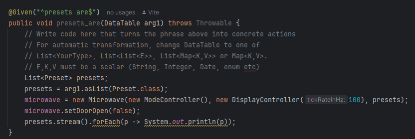

# Actividad Análisis de codigo Estático

En esta actividad se utilizara sonarlint asi como sonarcloud para analizar codigo asi como tambien se analizaran los stepdefs definidos pasar asi poder pasar los features correctamente

