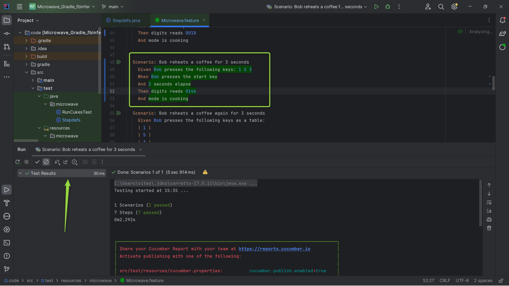
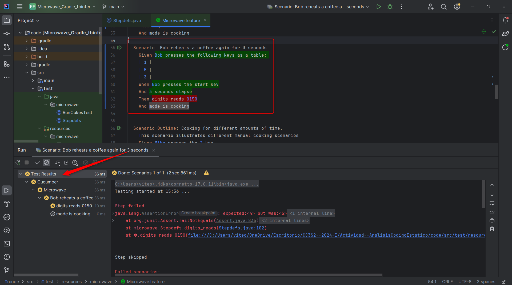
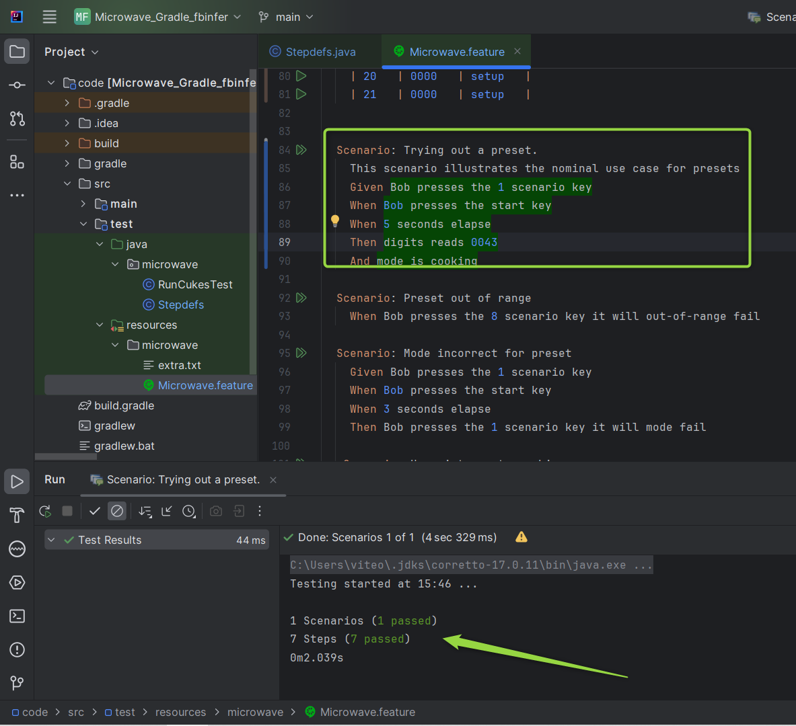
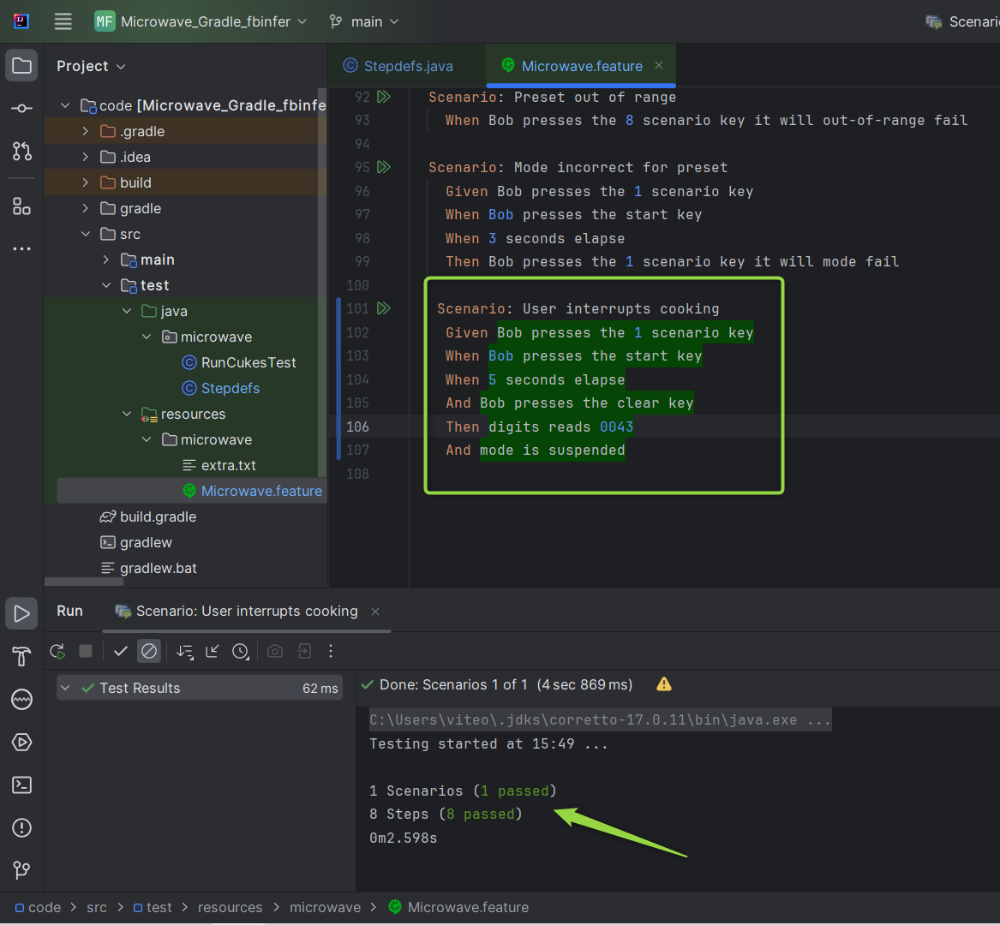
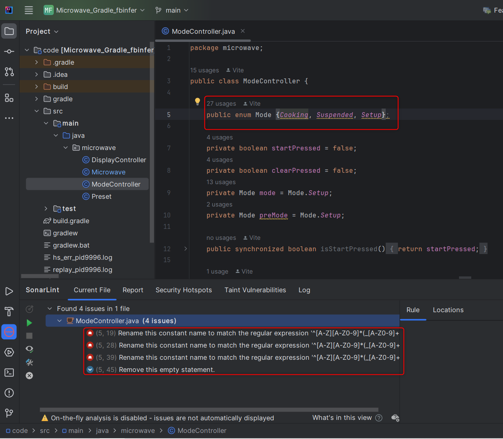
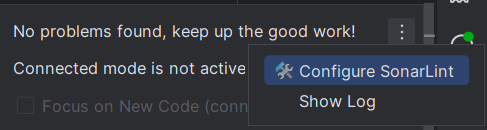
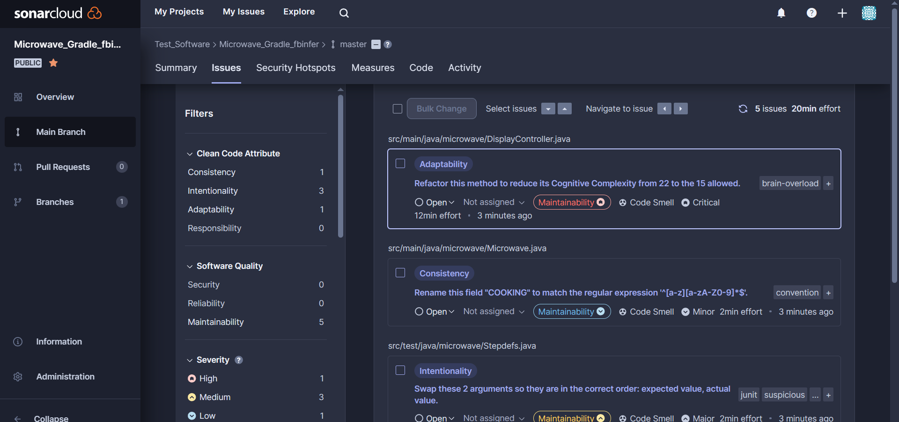

# Actividad Análisis de codigo Estático

En esta actividad se utilizara sonarlint asi como sonarcloud para analizar codigo asi como tambien se analizaran los stepdefs definidos pasar asi poder pasar los features correctamente

## Escenarios

### Scenario: Mike reheats a cookie for 1 second

Se observa que la prueba falla, especificamente se espera un 0018 como digitos pero se obtiene un 0019, cambiamos este valor y ahora las pruebas pasan satisfactoriamente
 

### Scenario: Bob reheats a coffee for 3 seconds

En este caso las pruebas fallan pero no por que el feature este mal escrito si no por los steps, vemos que el metodo split no esta bien escrito. 

Agregamos el espacio en blanco dentro del string para que capture los datos y volvemos a correr las pruebas

Se visualiza otro error, especificamente espera un 4 como digito pero recibio un 5, entonces cambiamos esto y el escenario pasa las pruebas correctamente

### Scenario: Bob reheats a coffee again for 3 seconds

Las pruebas fallan denuevo por un error en los digitos dentro del feature, los corregimos y la prueba pasa correctamente

### Scenario Outline: Cooking for different amounts of time.

En este escenario se utilizans ejemplos para validar los pasos definidos, corregimos los digitos asi como el estado del microondas y las pruebas pasan correctamente

### Scenario: Trying out a preset.

De nuevo error de escritura en el feature, corregimos los digitos y las pruebas pasan

### Scenario: User interrupts cooking

Por ultimo tenemos denuevo un error de digitos dentro de los pasos en el feature, los corregimos y las pruebas pasan

Una vez terminado de pasar las pruebas procedemos a ver el codigo fuente con las herramientas SonarLint y SonarCloud. Una vez hecho esto volveriamos a correr las pruebas y no deberiamos tener error en las pruebas ya que esto indicaria un error en la refactorizacion

## SonarLint Refactorizacion

Empezamos la revision del codigo clase por clase. En este caso solo veremos las que necesitan de un cambio.

Vamos a necesitar del plugin SonarLint, se descarga desde la seccion de plugins en intellij. Esta herramienta funciona independientemente asi que por el momento no vamos a necesitar de sonarcloud, lo veremos al final.

### DisplayController

En la clase DisplayController nos recomienda borrar un bloque de comentarios asi como reducir la complejidad de un metodo

Sugiere dividir el metodo en partes mas pequeñas ya que el mismo es muy largo pero esto lo dejaremos para despues de paso que lo visualizamos en sonar Cloud

### Microwave

Revisamos la clase Microwave

SonarLint nos recomienda remover el bloque de codigo comentado ya que es innecesario asi como declarar la variable cooking en una linea separada. Hacemos los cambios y volvemos a correr sonar

Con esto ya no hay necesidad de más cambios

### ModeController

En la clase ModeController nos recomienda cambiar el nombre de los enum para cumplir un estandar de convenciones asi como eliminar el punto y coma al final

Corregimos esas convenciones asi como el punto y coma y ya no tenemos que hacer mas cambios

## SonarCloud setup

Para configurar sonarcloud con nuestro proyecto debemos tener una cuenta en sonarcloud.io asi como el plugin sonarlint en intellij. Una vez hecho esto procedemos

Entramos a la configuracion de sonarlint

Escogemos configurar la conexion en sonarcloud

Elegimos un nombre y procedemos

Aca nos va a pedir un token que obtenemos dentro de la pagina de sonarcloud

Una vez pasado el token, nos a va pedir un project key que tambien se obtiene desde el sonarcloud

Una vez configurado podemos ver el analisis completo que se hizo en sonarcloud

