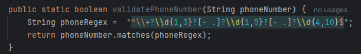
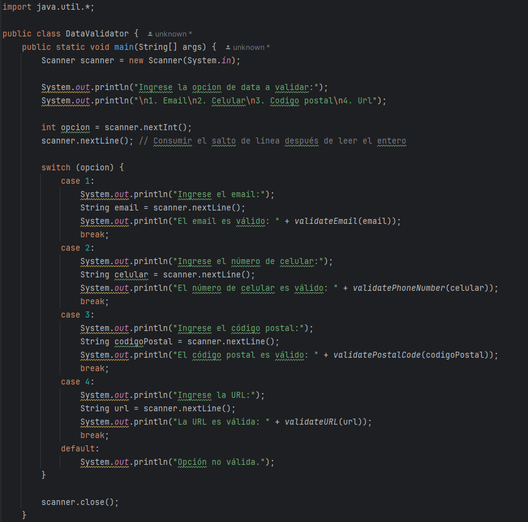
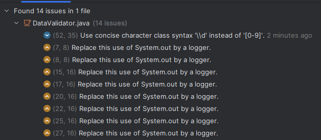
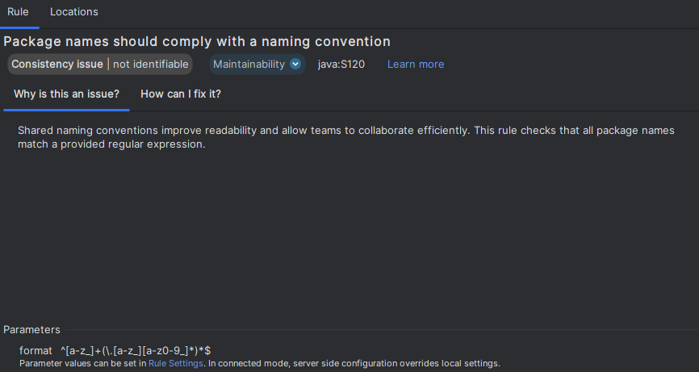
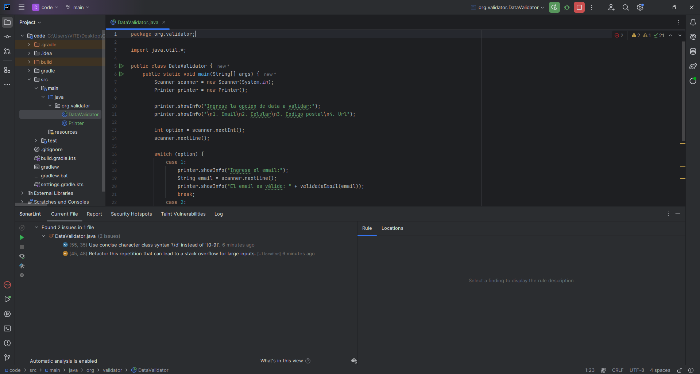
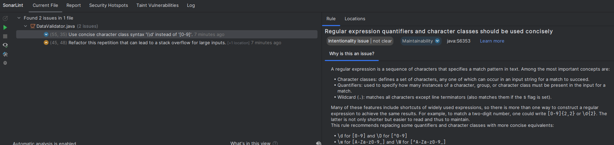
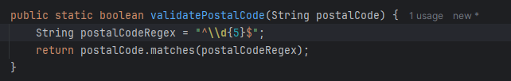

# Actividad Olores de codigo Refactorizacion y Principios de diseño 

## Problema

Validador de Formatos con Expresiones Regulares
Este es un problema de codificación que involucra el uso de expresiones regulares en Java, diseñado y enfocado en estándares de codificación, principios de diseño, olores de código y prácticas de codificación segura.

## Descripción

Desarrollar un sistema simple en Java que valide diferentes tipos de datos de entrada utilizando
expresiones regulares. Este sistema debería ser capaz de verificar varios formatos comunes como
emails, números de teléfono, códigos postales y URLs.

- Validacion de email

- Validacion de numero de celular

- Validacion de numero de codigo postal

- Validacion de url

Una vez creado los metodos codeamos una interfaz sencilla en la consola para validar la data

Ahora viene lo que nos interesa, utilizaremos la herramienta sonar lint para detectar olores de codigo asi como para refactorizarlo

SonarLint encontro 14 issues entre ellos problemas de mantenibilidad y fiabilidad, vamos a revisarlo uno por uno

### Replace this use of System.out by a logger

SonarLint nos sugiere usar un logger para poder diferenciar los tipos de mensaje que se muestran en consola, ahora para esto vamos a crear la clase Logger

Ahora nos sugiere crear un package el cual debe cumplir una expresion regular

Modificamos el nombre del package e implementamos el logger

Ahora volvemos al codigo principal y lo implementamos, se observa que se reducieron la cantidad de issues

### Use concise character class syntax

SonarLint nos sugiere cambiar la expresion regular de tal manera que usemos \\d en vez de [0-9]

Lo modificamos y asi se veria

### Refactor this repetition that can lead to a stack overflow

Lo que nos dice es que una cosa que aumenta significativamente el tamaño de la entrada que se puede procesar es si cada iteración de la repetición pasa por una cadena de múltiples caracteres constantes, ya que dichos caracteres consecutivos serán coincidentes por el motor regex sin invocar ninguna recursión.

Refactorizamos la expresion regular

Ahora si no tenemos ningun tipo de problema, por el momento el codigo esta refactorizado y listo para futuras implementaciones

## Problema

Sistema de notificaciones para un E-commerce usando Microservicios

## Descripcion

Desarrollar un sistema de notificaciones como parte de una arquitectura de microservicios para un
e-commerce. Este sistema debe ser capaz de enviar notificaciones por correo electrónico y SMS a los clientes cuando se cumplan ciertas condiciones (p.ej., una orden ha sido despachada, una promoción está por empezar).

