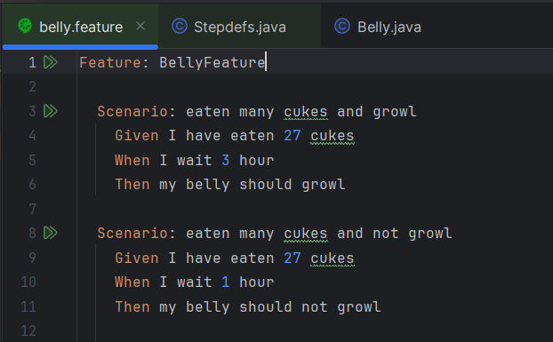
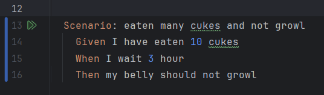
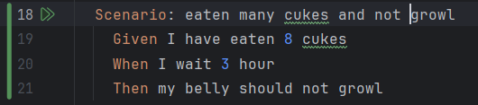
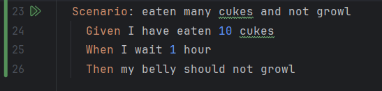
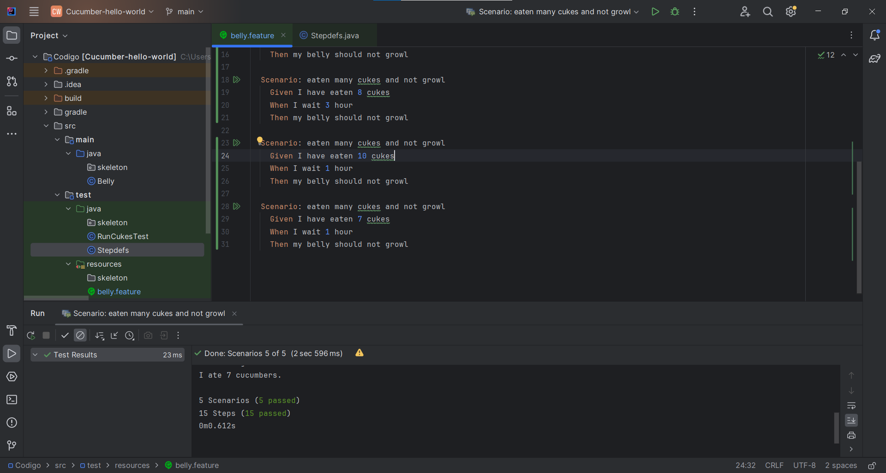

# Actividad Introduccion a Cucumber

En esta actividad tenemos un código que simula un estomago el cual come pepinos y espera un tiempo necesario (no come pepinos)

La clase Belly (estomago) tiene 2 variables (eatenCucumbers & timeWaited) para calcular la cantidad de pepinos comidos y tiempo esperado, si el tiempo esperado es mayor igual que 2 y ha comido mas de 10 pepinos el estomago va a gruñir

Para poder realizar las pruebas debemos tomar en cuenta los siguientes casos:

- timeWaited >= 2 && eatenCucumbers > 10 (caso base)
1. timeWaited >= 2 && eatenCucumbers = 10 
2. timeWaited >= 2 && eatenCucumbers < 10
3. timeWaited <= 2 && eatenCucumbers = 10
4. timeWaited <= 2 && eatenCucumbers < 10
5. timeWaited <= 2 && eatenCucumbers > 10

En el siguiente codigo se abordan tanto el caso base como el caso 5

Entonces debemos escribir los escensarios para los casos 1, 2, 3 y 4

- **Caso 1 - timeWaited >= 2 && eatenCucumbers = 10**

- **Caso 2 - timeWaited >= 2 && eatenCucumbers < 10**

- **Caso 3 - timeWaited <= 2 && eatenCucumbers = 10**

- **Caso 4 - timeWaited <= 2 && eatenCucumbers < 10**

Por último ejecutamos los escenearios y observamos que todos pasan satisfactoriamente.

