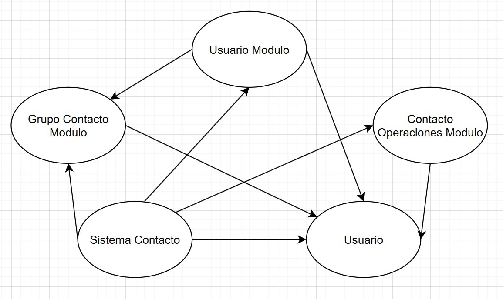
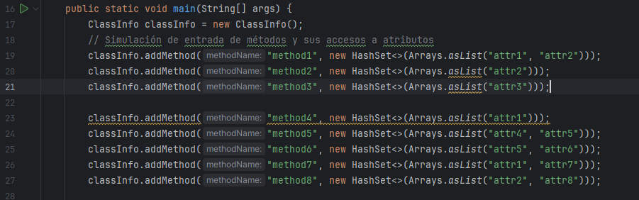
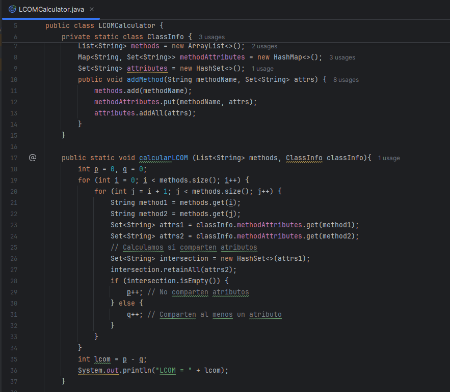
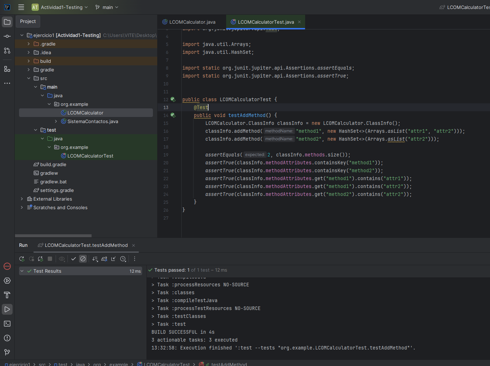

# Actividad Metricas de Calidad de Software

# Ejercicio: Analiza el Acoplamiento y realiza el cálculo del factor de acoplamiento (CF)

## Acoplamiento eferente

Clase UsuarioModulo (2)

- `Usuario` : instancia del objeto Usuario
- `AgregarUsuario` : metodo que utiliza la clase Usuario

Clase Grupo Contacto Modulo (2)

- `Usuario` : Utiliza una lista de objetos de la clase Usuario
- `agregarUsuario` : metodo que tiene como parametro la clase Usuario

Clase Contacto Operaciones Modulo (2)

- `enviarMensaje`: usa un objeto de la clase Usuario como parametro

Clase Sistema Contactos (3)

- `usuarioModulo` : instancia de la clase Usuario Modulo
- `usuario` : instancia de la clase Usuario
- `operacionesModulo` : instancia de la clase Contacto Operaciones Modulo  

## Acoplamiento aferente

Clase UsuarioModulo ()

- `usuarioModulo` : instancia usada en la clase Sistema Contactos

Clase Grupo Contacto Modulo

- `agregarUsuarioAGrupo` :  metodo usado en la clase UsuarioModulo
- `crearGrupo` : metodo utilizado en la clase Sistema Contactos

Clase Contacto Operaciones Modulo

- `operacionesModulo`: instancia utilizada en la clase Sistema Contactos

Clase Usuario

- Hay 6 modulos que utilizan instancias del tipo Usuario

## Factor de Acoplamiento

`CF = e / (a*(n-1)) `

Donde

- Numero total de conexiones (e) = 8
- Numero de modulos en el sistema (a) = 5
- Numero total de modulos = 5

Entonces `CF = 0.4`

# Ejercicio: LCOMCalculator

## Extender LCOMCalculator para incluir más métodos y atributos

Si en un inicio ejecutamos el programa tenemos como resultado un LCOM = 1 por que el numero de pares que no compartes atributos (2) menos el numero de pares que si comparten atributos (1) es igual a 1

Para ver si como varian los valores de p y q agregamos mas metodos con atributos distintos

Ejecucion:

## Refactorizar LCOMCalculator para mejorar la legibilidad y eficiencia

Separamos la logica del calculo del LCOM creando el metodo calcularLCOM

## Implementar unidades de pruebas para LCOMCalculator

# Ejercicio: Para el siguiente diagrama de clases, calcula el valor de Inestabilidad para la clase Stop y PassengerUnloader: 

## Clase Stop

### Acoplamiento eferente

La clase Stop utiliza:

- `LoadPassengers` : utiliza un puntero a un objeto de tipo `Bus`
- `AddPassengers` : utiliza un puntero a un objeto de tipo `Passenger`

### Acoplamiento aferente

Modulos que utilizan un modulo propio de la clase Stop:

Clase Route

- `destinationStop`: puntero a la clase Stop usado 
- `Route` : metodo que tiene como parametro un puntero de la clase Stop
- `GetDestinationStop` : metodo que retorna un puntero de tipo Stop 

Clase PassengerGenerator

- `_stops` : variable de tipo List con elementos puntero Stop

### Inestabilidad

`I = Ce / (Ca + Ce)`

Donde 

- Acoplamiento eferente (Ce) = 2 
- Acoplamiento aferente (Ca) = 4

Entonces `I = 0.333`

## Clase PassengerUnloader

### Acoplamiento eferente

La clase PassengerUnloader utiliza:

- `UnloadPassenger()` : metodo que utiliza la clase Stop 

### Acoplamiento aferente

Modulos que utilizan un modulo propio de la clase PassengerUnloader:

Clase Bus

- `UnloadPassenger()`: metodo propio de la clase PassengerUnloader 

### Inestabilidad

`I = Ce / (Ca + Ce)`

Donde 

- Acoplamiento eferente (Ce) = 1
- Acoplamiento aferente (Ca) = 1

Entonces `I = 0.5`

***

