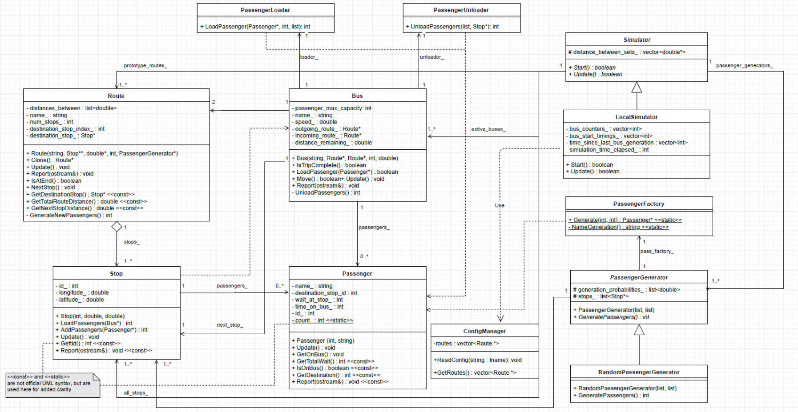

# Actividad Metricas de Calidad de Software

Para el siguiente diagrama de clases, calcula el valor de Inestabilidad para las clases:

- Stop
- PassengerUnloader

Usa hasta 3 cifras significativas



***

# Clase Stop

## Acoplamiento eferente

La clase Stop utiliza:

- `LoadPassengers` : utiliza un puntero a un objeto de tipo `Bus`
- `AddPassengers` : utiliza un puntero a un objeto de tipo `Passenger`

## Acoplamiento aferente

Modulos que utilizan un modulo propio de la clase Stop:

**Clase Route**

- `destinationStop`: puntero a la clase Stop usado 
- `Route` : metodo que tiene como parametro un puntero de la clase Stop
- `GetDestinationStop` : metodo que retorna un puntero de tipo Stop 

**Clase PassengerGenerator**

- `_stops` : variable de tipo List con elementos puntero Stop

## Inestabilidad

`I = Ce / (Ca + Ce)`

Donde 

- Acoplamiento eferente (Ce) = 2 
- Acoplamiento aferente (Ca) = 4

Entonces `I = 0.333`

***

# Clase PassengerUnloader

## Acoplamiento eferente

La clase PassengerUnloader utiliza:

- `` : 
- `` : 

## Acoplamiento aferente

Modulos que utilizan un modulo propio de la clase PassengerUnloader:

**Clase **

- ``: 
- `` : 
- `` : 

**Clase **

- `` : 

## Inestabilidad

`I = Ce / (Ca + Ce)`

Donde 

- Acoplamiento eferente (Ce) = 
- Acoplamiento aferente (Ca) = 

Entonces `I =`

***

Calcula el valor de la medicion LCOM4 para el siguiente codigo

```c
#include "src/route.h"

Route::Route(std::string name, Stop ** stops, double * distances,

int num_stops, PassengerGenerator * generator) {
// Los constructores se ignoran en el cálculo de LCOM4
}

void Route::Update() {
    GenerateNewPassengers();
    for (std::list<Stop *>::iterator it = stops_.begin();
        it != stops_.end(); it++) {
        (*it)->Update();
    }
}

bool Route::IsAtEnd() const {
    return destination_stop_index_ >= num_stops_;
}

void Route::NextStop() {
    destination_stop_index_++;
    if (destination_stop_index_ < num_stops_) {
        std::list<Stop *>::const_iterator iter = stops_.begin();
        std::advance(iter, destination_stop_index_);
        destination_stop_ = *iter;
    } else {
        destination_stop_ = (*stops_.end());
    }
}

Stop * Route::GetDestinationStop() const {
    return destination_stop_;
}

double Route::GetTotalRouteDistance() const {
    int total_distance = 0;
    for (std::list<double>::const_iterator iter = distances_between_.begin();
        iter != distances_between_.end();
        iter++) {
        total_distance += *iter;
    }
    return total_distance;
}

double Route::GetNextStopDistance() const {
    std::list<double>::const_iterator iter = distances_between_.begin();
    std::advance(iter, destination_stop_index_-1);
    return *iter; // resolviendo el iterador se obtiene el Stop * de la lista
}

int Route::GenerateNewPassengers() {
// devolviendo el número de pasajeros añadidos por el generador
    return generator_->GeneratePassengers();
}
```