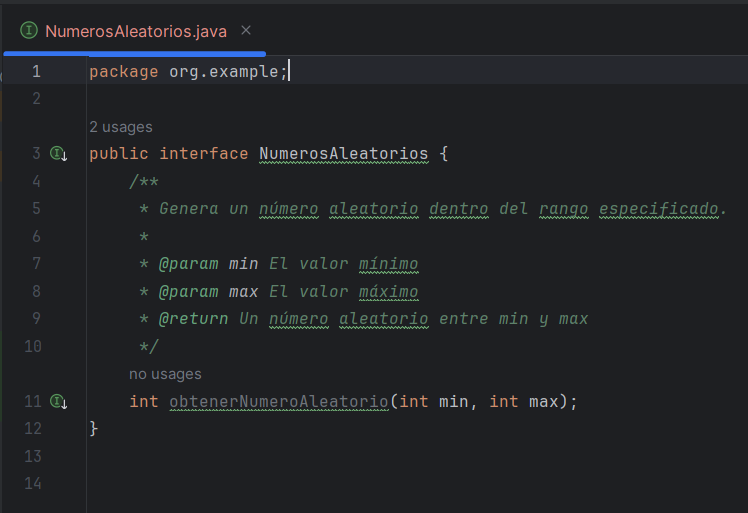
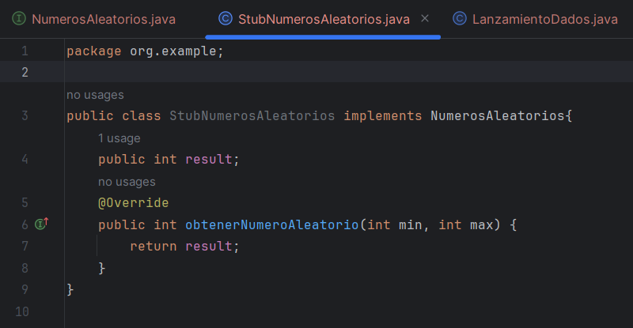
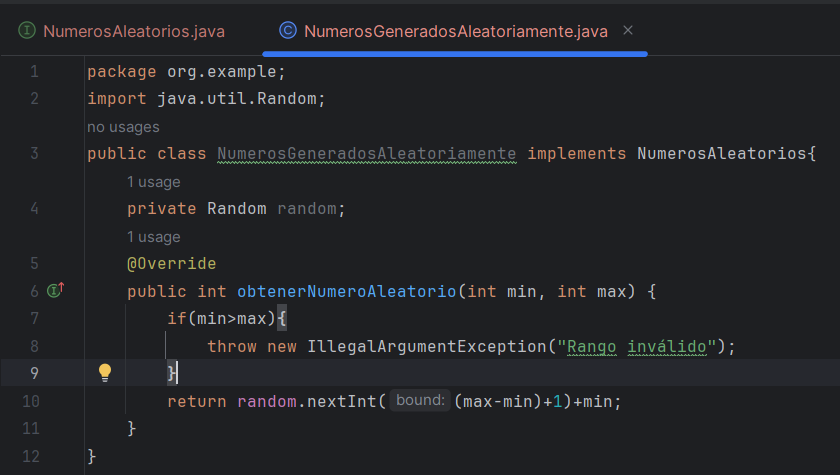

# Actividad Stubs y Mocks

## Simulador de lanzamiento de Dados
### Paso 1

Crear una interfaz NumerosAleatorios que defina un método para obtener números aleatorios dentro de un rango específico

No se define la logica del metodo por que eso se verá en otra clase en pasos más adelante

### Paso 2

Modificar la clase LanzamientoDados para que utilice la interfaz NumerosAleatorios, inyectando la dependencia a través del constructor

### Paso 3

Desarrollar un stub de NumerosAleatorios para usar en pruebas unitarias, permitiendo controlar los resultados de los lanzamientos

Creamos un stub que sobrescribe el metodo obtenerNumeroAleatorio para controlar el resultado que queremos obtener y asi poder escribir las pruebas

### Paso 4

Escribir pruebas unitarias para LanzamientoDados utilizando el stub para asegurar que la lógica del lanzamiento funciona como se espera bajo condiciones controladas

Nuestro stub retorna un numero fijo asi que para testear este usamos el metodo isEqualTo

### Paso 5

Implementar una clase NumerosGeneradosAleatoriamente que utilice un generador de números aleatorios real y que cumpla con la interfaz NumerosAleatorios.

### Paso 6

Integrar y probar la clase LanzamientoDados en una aplicación de producción, inyectando la implementación real de NumerosAleatorios

Primero agregamos el metodo lanzarDados a la clase LanzamientoDados

Luego creamos los objetos necesarios asi como la inyeccion de dependencias (NumerosGeneradosAleatoriamente) y llamar al metodo real lanzarDados

## Sistema de notificaciones por email

### Paso 1

Definir una interfaz MailServer que abstraiga el envío de correos electrónicos

### Paso 2

Crear una clase UserNotifications que dependa de la interfaz MailServer para enviar correos

### Paso 3

Implementar un mock de MailServer que registre las llamadas a su método sendEmail y capture los valores de los parámetros enviados

### Paso 4

Escribir pruebas unitarias para UserNotification utilizando mock para verificar que los correos se envíen correctamente

### Paso 5

Implementar una clase RealMailServer que use SMTP para enviar correos en un entorno de producción

### Paso 6

Integrar UserNotifications en una aplicación de producción, inyectando la implementación real de MailServer
