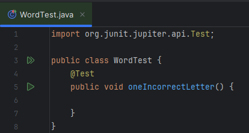
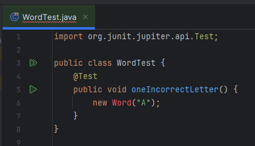
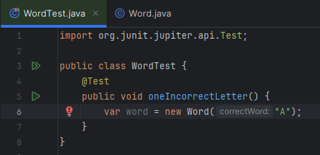
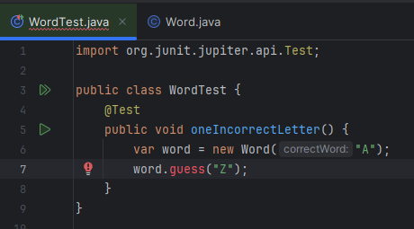
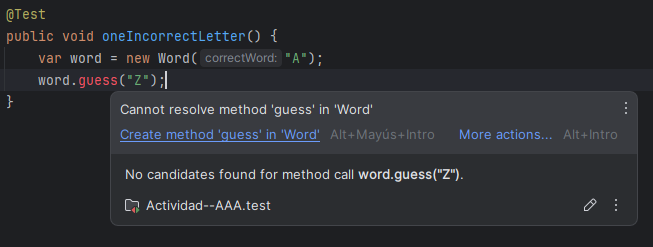
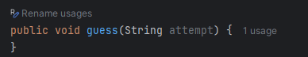
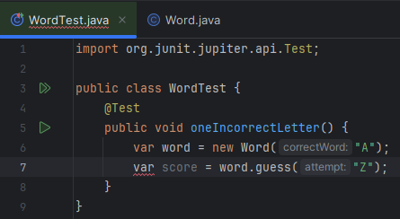
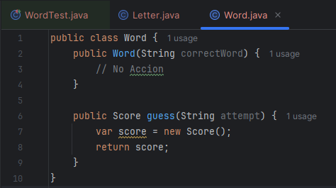
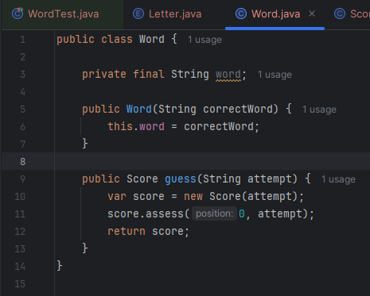

# Actividad TDD
Vamos a comenzar con una clase que contendrá la parte central de la lógica de la aplicación, una que  represente una palabra para adivinar y que pueda calcular el puntaje de una suposición.
Comenzamos creando una clase de prueba unitaria y esto nos pone inmediatamente en modo de
diseño de software

Para empezar, escribamos una prueba que arroje la puntuación de una sola letra que sea incorrecta:

1. Escribimos el siguiente código para comenzar nuestra prueba

2. Decidimos usar una clase llamada Word para representar nuestra palabra. También decidimos proporcionar la palabra a adivinar como un parámetro de construcción para nuestra instancia de objeto de la clase Word que queremos crea

3. Ahora, renombramos el parámetro del constructor de Word

4. A continuación, volvemos a la prueba. Capturamos el nuevo objeto como una variable local para
que podamos probarlo:

5. Pasar la adivinación es una decisión fácil: usaremos un método que llamaremos guess(images/). Podemos
codificar estas decisiones en la prueba:

6. Use autocompletar para agregar el método guess(images/) a la clase de Word:

7. Haz clic en Enter para agregar el método, luego cambie el nombre del parámetro a un nombre
descriptivo:

8. A continuación, agreguemos una forma de obtener la puntuación resultante de esa suposición.
Comienza con la prueba:

Después de reflexionar sobre qué hacer, estas son las tres decisiones de diseño que usaremos en este código:

- Admitir un número variable de letras en una palabra
- Representar la puntuación mediante una enumeración simple INCORRECT, PART_CORRECT,
o CORRECT
- Acceder a cada puntaje por su posición en la palabra, basado en cero

Estas decisiones respaldan el principio KISS es decir Keep It Simple

9. Capturamos estas decisiones en las pruebas

10. Se observa claramente que estas pruebas fallan pero en eso consiste el TDD, con las pruebas hechas ya podemos ir empezando a implementar el codigo fuente

11. Hagamos que la prueba pase agregando código a la clase Word:

12. A continuación, creamos la clase score:

Si bien las pruebas pasan, el codigo tiene mejoras por hacer.

La clase Letter la cambiamos por una clase enum

Agregamos el metodo assess en la clase Score para la logica del juego (images/adivinar letras)

Una vez hecho esto implementamos el constructor de la clase Score y su metodo guess

Y se observa que las pruebas pasan correctamente

