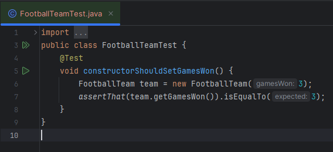
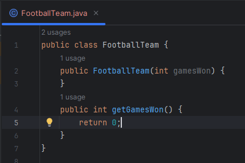
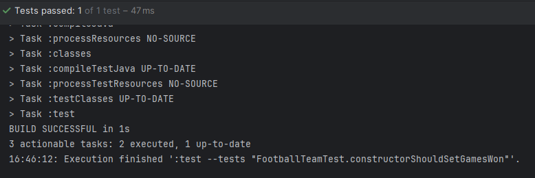

# Actividad Ejemplo de TDD

Para poder comparar dos equipos, cada uno de ellos debe recordar su número de victorias. Por
simplicidad, diseñemos una clase FootballTeam que tome el número de juegos como parámetro del
constructor.

Lo primero es lo primero: asegurémonos de que este constructor funcione.
Comenzamos creando una nueva clase - FootballTeamTest - en algún lugar del directorio
src/test/java.

Ahora procedemos a crear la clase FootballTeam con su constructor y su metodo getGamesWon()

Una vez hecho esto empezamos con el RGR

---

## RED

Al correr la prueba se observa que esta falla como se esperaba

## GREEN

Una vez fallada la prueba empezamos a codear para hacerla pasar

En este caso cambiamos el valor del return de 0 a 3 dado que esa era la causa de que no pase el test. Ahora se observa que las pruebas pasan satisfactoriamente

## REFACTOR

Una vez pasada la prueba, refactorizamos el codigo por mas insignificante que sea el cambio. En este caso podemos cambiar el test dado que utiliza una constante (numero magico)

---

Si bien completamos el proceso RGR, el codigo es aun mejorable dado que el valor que esta retornando es estatico (en este caso el 3) podemos usar this. para poder usar diferentes valores (no solo el 3)
