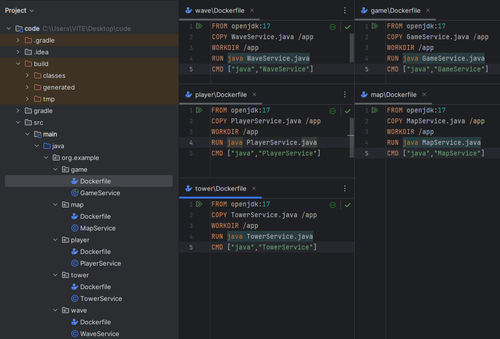
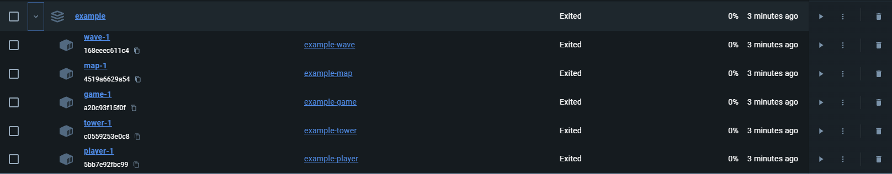
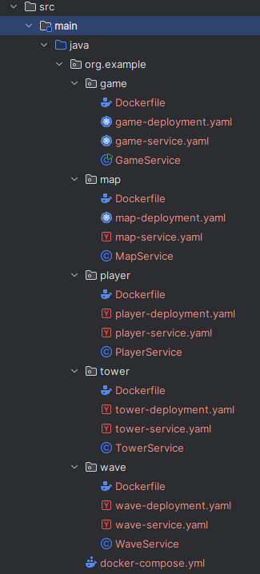
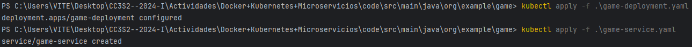
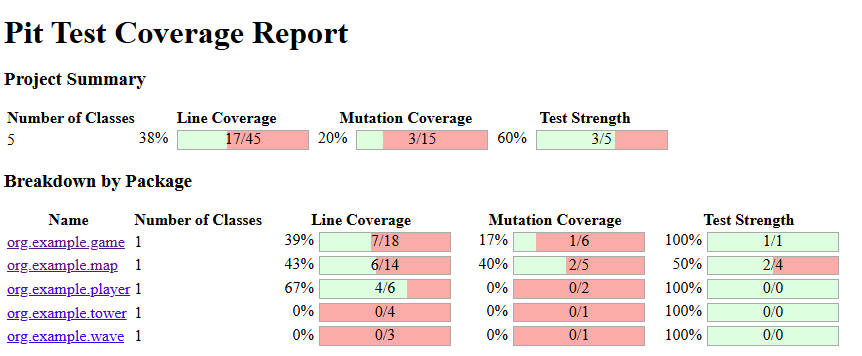

# Docker + Kubernetes + Microservicios / V3

Para esta actividad vamos a dividir el proyecto en diferentes componentes (servicios) para luego subirlos a docker y manejarlo con kubernetes

Esta es la estructura del proyecto donde cada servicio tiene su propio docker file



## Containers + Images

Corremos todos los dockerfiles para tener los contenedores con sus imagenes


Con `docker start` ejecutamos los contenedor para luego agregarlos a la red `game-network`


Una vez agregados, nuestro dashboard se ve asi


Por ultimo vinculamos nuestros contenedores con el volume con `docker run -v path` donde -v indica que vamos a vincular un volumen y el path es el directorio donde va a estar ubicado y asi se veria nuestro volume


## Docker Compose

Una vez hecho todo esto podemos pasar a crear nuestro servicio con `docker compose`, este archivo lo creamos en org.example para poder acceder a las rutas de los dockerfile con build de manera sencilla. Asi se veria 


Ahora si ejecutamos `docker-compose up` y una vez finalizado podemos ver en docker desktop que se ha creado el servicio



## Deployment + Services Kubernetes

Creamos todos los archivos.yaml (despliegue y servicios) necesarios para cada uno de los microservicios (game, map, player, tower, wave)



> [!IMPORTANT] 
> Antes de ejecutar `kubectl apply -f file.yaml` se encontro un problema con 
docker desktop, por alguna razon no detectaba las imagenes locales y para solucionar esto creamos un registro local utilizando una imagen predefinida del dockerhub, dentro de esta pusheamos nuestras imagenes y accedemos con la siguiente ruta `localhost:3000/game-image:latest`

Corremos los despligues y servicios



## Mockito

Para implementar mockito en nuestro proyecto primero necesitamos las dependencias, entonces agregamos las siguientes lineas en nuestro `build.gradle` especificamente en la seccion `dependencies`

```
testImplementation 'org.mockito:mockito-inline:3.12.4'
```
```
testImplementation 'org.mockito:mockito-junit-jupiter:3.12.4'
```

Escribimos unas pruebas para el metodo placeTower utilizando mocks de TowerService asi como de GameService


## Pitest

Para implementar pitest en nuestro proyecto primero necesitamos las dependencias, entonces agregamos las siguientes lineas en nuestro `build.gradle` especificamente en la seccion `dependencies`

```
pitest 'org.pitest:pitest-junit5-plugin:1.1.0'
```

Y aparte creamos una seccion `pitest` donde vamos a establecer una configuracion personalizada para las pruebas mutantes

```
pitest{
    targetClasses = ['org.example.*']
    outputFormats = ['HTML']
    timestampedReports = false
}
```

Una vez hecho esto ya podemos correr `./gradlew pitest` y ver nuestro reporte con la cobertura de codigo y los mutantes



Esto nos indica que no se han testeado todas las funciones existentes, y que hay varios mutantes vivos. Todo esto se debe a que solo hemmos testeado un metodo


