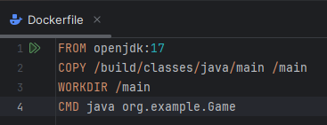
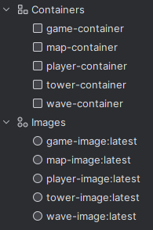
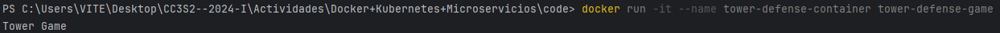
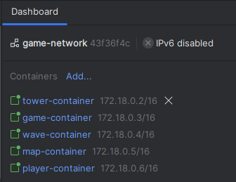

# Docker + Kubernetes + Microservicios

## V1

### Configuracion de Docker

Creamos nuestro dockerfile

Luego creamos la imagen por comando `docker build -t tower-defense-game .` o tambien podemos usar intellij con el plugin de Docker especificando el tag (tower-defense-game) que le vamos a dar a la imagen

Ejecutamos el contenedor `docker run -it --name container tower-defense-container tower-defense-game`

### Configuracion de Redes y Volumenes de Docker

Creamos una red personalizada `docker network create game-network`, se observa en la interfaz de intellij que la red game-network ha sido creada

Ejecutamos el contenedor en la red

## V2

## V3