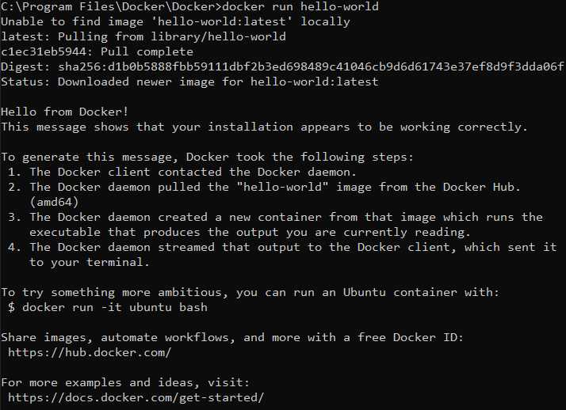
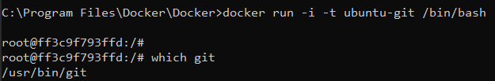
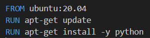
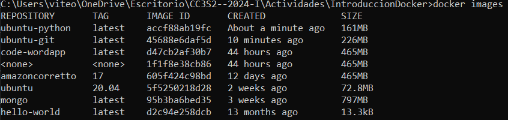
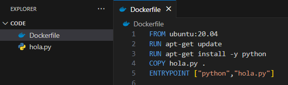
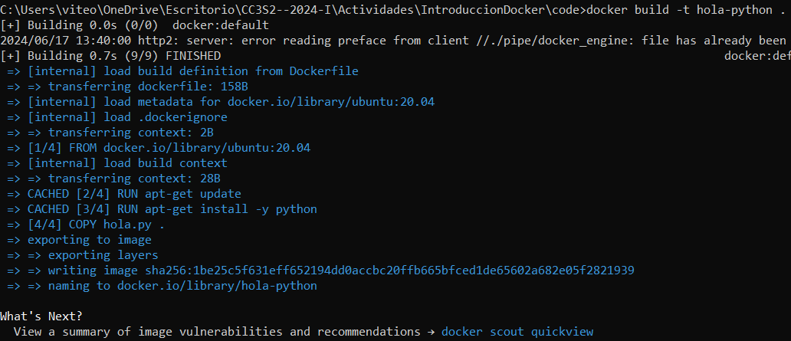
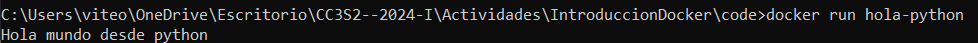

# Actividad Introduccion a Docker

Probamos la instalacion de docker con `docker info`

Luego corremos nuestro primer contenedor `docker run hello-world`

## Ubuntu Git

Comenzaremos con un ejemplo y preparemos una imagen con los kits de herramientas de Git y JDK. Usaremos Ubuntu 20.04 como imagen base.

1. Ejecuta un contenedor desde ubuntu:20.04 y conéctalo a tu línea de comando `docker run -i -t ubuntu:20.04 /bin/bash`

2. Instalamos el kit de herramientas de git

- `apt-get update`
- `apt-get install -y git`

3. Comprobamos si el kit de herramientas se instaló correctamente `which git`

4. Salimos del contenedor `exit` y verificamos qué ha cambiado en el contenedor comparando su identificador (ID) de contenedor único con 
la imagen de ubuntu `docker diff 60b0b1842a26`

5. Commit el contenedor a la imagen `docker commit 60b0b1842a26 ubuntu-git` y verificamos que la imagen este presente con `docker images`

6. Ahora, si creamos un contenedor a partir de la imagen, tendrás instalada la herramienta Git 

## Ubuntu Python

Ahora haremos lo mismo pero con una imagen de ubuntu python y usando un Dockerfile 

1. Creamos un archivo dockerfile

2. Ejecutamos nuestro dockerfile `docker build -t ubuntu-python .`

3. Comprobamos que se haya creado la imagen `docker images`

## Aplicacion Docker completa

1. Creamos un directorio con los archivos hola.py y el Dockerfile

2. Corremos nuestro docker con `docker build -t hola-python .`

3. Ejecutamos la aplicacion `docker run hola-python`

## Ejercicio

 Este simple este ejercicio te guiará a través del proceso de configuración y ejecución de una simple aplicación cliente-servidor utilizando Python y Docker. El objetivo es aprender cómo los contenedores Docker pueden ser utilizados para desplegar aplicaciones de manera aislada y eficiente.

- Parte 1: Exploracion y ejecucion local

