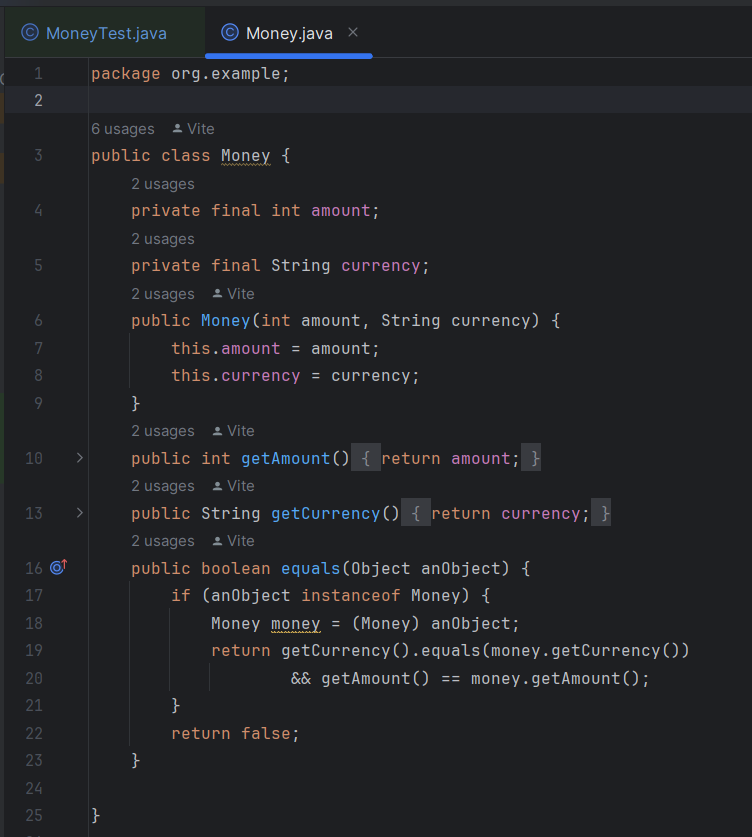
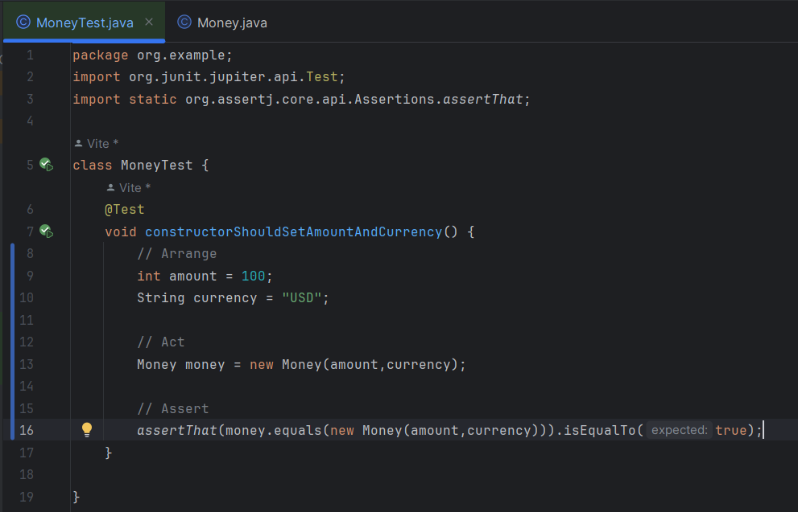

# Actividad JUnit 5 & Testing

## Pregunta - 1

Explica el siguiente gráfico en términos de SUT y DOC para pruebas unitarias


## Respuesta - 1

En el gráfico se observa el flujo de un entorno de pruebas.

1. Test Class define un conjunto de pruebas que utilizan las entradas directamente para evaluar el SUT
2. Las respuestas obtenidas en el SUT son enviadas y usadas indirectamente por los DOCs

> Las dependencias de compononentes (servicios externos, APIs, base de datos, etc) deben ser evaluadas para garantizar la confiablidad de las pruebas  

3. Durante la ejecución de una prueba las entradas pueden ser influenciadas por las dependencias de objetos colaboradores (DOCs) o ser directamente definidas en la prueba.

4. El test class verifica las salidas generadas por el SUT con el objetivo que sean las esperadas.

## Pregunta - 2

Imaginemos algún servicio financiero (clase FinancialService) que, en función del último pago del 
cliente y su tipo (cualquiera que sea), calcula algún "bonus"

```Java
public class FinancialService {
.... // definition of fields and other methods omitted
    public BigDecimal calculateBonus(long clientId, BigDecimal payment) {
        Short clientType = clientDAO.getClientType(clientId);
        BigDecimal bonus = calculator.calculateBonus(clientType, payment);
        clientDAO.saveBonusHistory(clientId, bonus);
        return bonus;
    }
}
```

Identifica el SUT y sus colaboradores (DOC) y describe los tipos de interacción que ocurren 
dentro del método calculateBonus() importantes para la prueba

## Respuesta - 2

**SUT**: Clase FinancialService

**DOCs**: clientDAO & calculator

Dentro del método calculateBonus():

1. Se llama al método de la clase clientDAO para obtener el tipo de cliente usando su id

2. Utiliza calculator para calcular el bonus basandose en el tipo de cliente y su pago respectivo

3. Una vez calculado el bono llama al método saveBonusHistory para guardar el historial de bonificaciones del cliente 
## Pregunta - 3

Sea la abstracción POO siguiente:


¿Como crees que serían las pruebas de los trabajos y la de los gerentes? ¿Por qué preocuparse 
por las interacciones indirectas?

## Respuesta - 3


## Pregunta - 4

Completa en la actividad dada en el repositorio el código fuente para pasar las pruebas

## Respuesta - 4

Dada la clase Money



Debemos escribir una prueba tal que verifique el constructor de la clase Money para esto utilizaremos el método booleano equals el cual nos ayuda a identificar un objeto bien creado

- **Arrange**

Inicializamos las variables a usar (amount & currency)

- **Act**

Instanciamos un objeto de la clase Money con las variables previamente definidas

- **Assert**

Usamos el método equals para corroborar la correcta creación del objeto con los datos establecidos



Por último ejecutamos las pruebas y se observa que se pasaron satisfactoriamente


## Pregunta - 5

¿Cuál es la diferencia entre una prueba unitaria y otros tipos de pruebas, como las pruebas de 
integración o las pruebas de aceptación?

## Respuesta - 5

Las pruebas unitarias se enfocan en verificar un funcionamiento correcto de unidades individuales de código, las pruebas de integración se centran en la interacción entre diferentes componentes del sistema, y las pruebas de aceptación se enfocan en validar si el sistema cumple con los requisitos y expectativas del usuario