# Actividad Play With Docker

En esta actividad haremos los Stage 1 y 2 del proyecto PWD (Play with Docker), estos stages los encuentras en [Play with Docker Stages](https://training.play-with-docker.com/)

# Stage 1: The Basics

Este stage consiste en los fundamentos basicos y nos va a ayudar a entender el proposito funcional del valor de Docker

##  Your First Linux Containers

1. Traemos la imagen de Alpine `docker image pull alpine`

Vamos a correr el container Alpine Linux en el Docker Playground

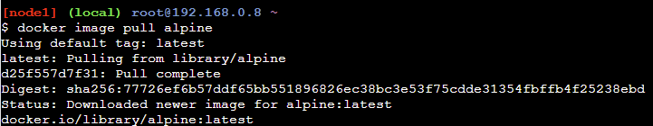

2. Listamos todas las imagenes para ver que se haya traido correctamente `docker image ls`

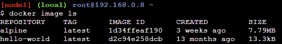

3. Corremos el docker container basado en la imagen alpine `docker container run alpine ls -l`

4. Una vez hecho esto podemos ejecutar comandos dentro de nuestro container como por ejemplo decirle que nos retorne un "hello from alpine" `docker container run alpine echo "hello from alpine"`

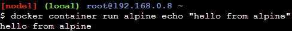

5. Listamos todos los contenedors que hayamos corrido previamente `docker container ls -a`

6. Tambien podemos entrar a la consola del contenedor y seguir ejecutando comandos en ella aisladamente `docker container run -it alpine /bin/ash`

7. Creamos un archivo de texto `echo "hello world" > hello.txt`

8. Corremos un container con su id y lo comprobamos **(no es necesario escribir todo su id)** `docker container start 5017` `docker container ls`

9. Mandamos un comando dentro del container para listar los archivos y se observa el archivo.txt que creamos en el punto 7 `docker container exec 5017 ls`

##  Customizing Docker Images

En esta seccion vamos a customizar nuestros images para que se pueda compartir con los demas 

1. Corremos una terminal en un container de ubuntu `docker container -it ubuntu bash`

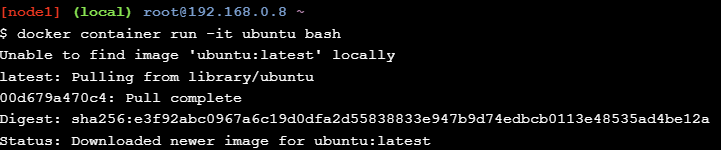

2. Instalamos el paquete figlet `apt-get update` `apt-get install -y figlet` `figlet "hello docker"`

3. Ahora convertimos nuestra contenedor con dependencias instaladas en una imagen que se pueda compartir con otros. Para hacer esto debemos obtener primero el id del container y luego hacer "comitear" este container y verificamos que se haya creaado `docker container commit <containerID>`

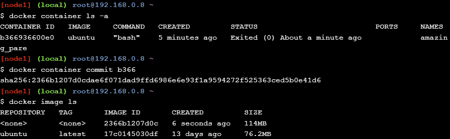

4. Vamos a etiquetar nuestra imagen para que sea mas amigable al momento de identificarlo `docker image tag <imageID> <etiqueta>`

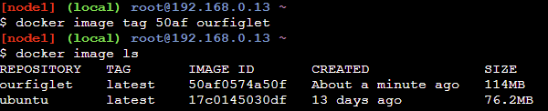

5. Corremos un comando para verificar que funcione correctamente

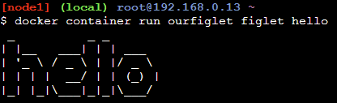

##  Deploy and managing multiple containers

En esta seccion aprenderemos sobre docker compose y docker swarm mode usando 2 terminales (node1-leader y node2-worker)

1. Inicializamos el docker swarm mode en el node1 `docker swarm init --advertise-addr $(hostname -i)`

2. En el node2 nos unimos al swarm mode mediante el token que nos dieron `docker swarm join --token <token> 168.0.7:2377`

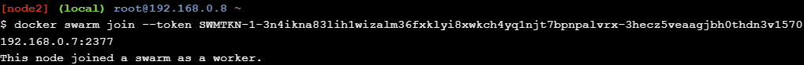

3. Verificamos en el node1 que se haya agregado nuestro worker `docker node ls`

4. Ahora vamos a clonar una app de votacion

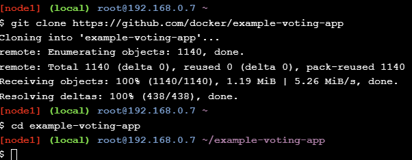

5. Hacemos deploy de la app usando el archivo yaml `docker stack deploy --compose-file=docker-stack.yml voting_stack`

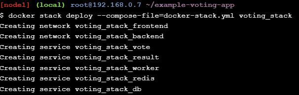

6. Verificamos que haya terminado correctamente `docker stack ls`\

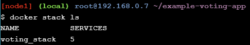

# Stage 2: Diggin Deeper

En esta etapa aprenderemos más sobre algunos de los temas avanzados de Docker

## Java Development: Intellij + Docker