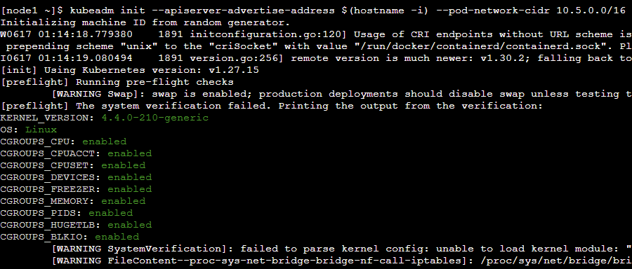
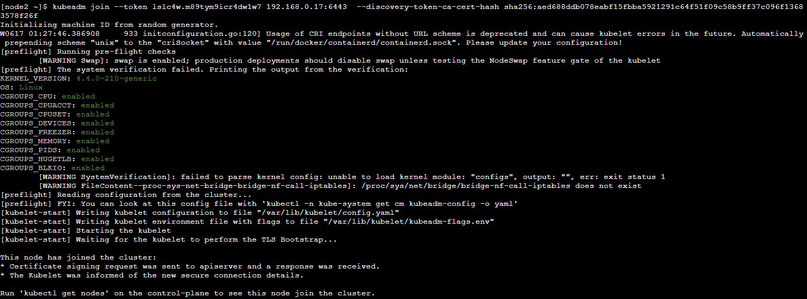
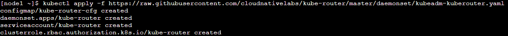
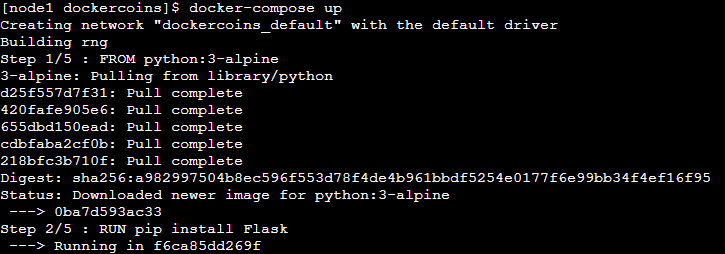
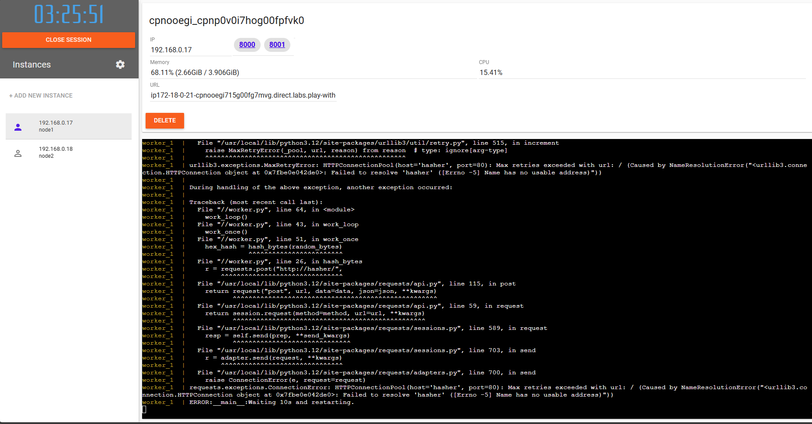

# Actividad Play with Kubernetes

Kubernetes es una plataforma de codigo de abierto que permite gestionar y administrar cargas de trabajo y servicios en contenedores. En esta actividad veremos un uso de kubernetes para principiantes usando un [Online Playground](https://labs.play-with-k8s.com/) asi como la [guia respectiva](https://training.play-with-kubernetes.com/kubernetes-workshop/)

## Inicializar Cluster

Para iniciar nuestro cluster utilizamos el siguiente comando `kubeadm init --apiserver-advertise-address $(hostname -i) --pod-network-cidr 10.5.0.0/16`

Una vez finalizado nos uniremos a este cluster mediante otra terminal con el token, el ip y el hash que nos dara el comando de arriba `kubeadm join --token SOMETOKEN SOMEIPADDRESS --discovery-token-ca-cert-hash SOMESHAHASH`

Iniciamos la red del cluster `kubectl apply -f https://raw.githubusercontent.com/cloudnativelabs/kube-router/master/daemonset/kubeadm-kuberouter.yaml`

## Uso de DockerCoins

Clonamos el repo `https://github.com/dockersamples/dockercoins.git` y ejecutamos el docker-compose.yaml

