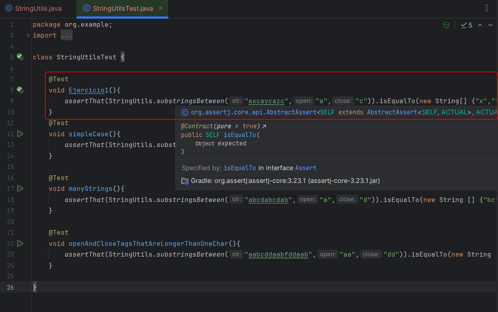
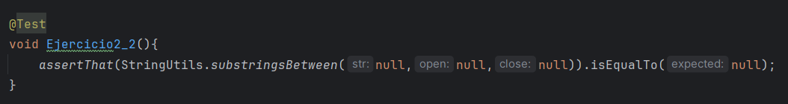
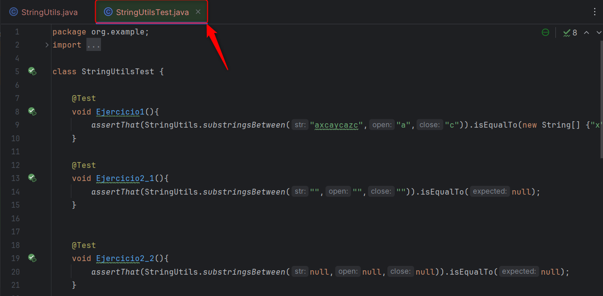

# Actividad Pruebas basadas en especificaciones

Creamos la la clase StringUtils la cual se encarga de calcular los caracteres no repetidos que hay entre dos letras (open y close)

## Ejercicio 1

Escribe el código de prueba y considera las entradas str = "axcaycazc", open = "a" y close = "c" y explica lo que hace el código anterior.

La prueba Ejercicio1 recibe como parametros los strings dados y espera como retorno los caracteres no repetidos entre los limites, es decir "x", "y" y "z"

## Ejercicio 2

Revisa los requisitos una vez más y escribe todos los casos de prueba que se te ocurran. El formato no importa, puede ser algo así como "todos los parámetros son nulos". Cuando hayas terminado con esta nota, compara tu conjunto de pruebas inicial con el que estamos a punto de derivar.

Posibles combinaciones de caracteres en las pruebas

- Si se recibe cadenas vacias como parametros se espera un null

- Si se recibe cadenas nulas como parametros también se espera un null

- Si se recibe una combinacion de cadenas vacias y cadenas nulas también se espera un null

## Ejercicio 3

Este ejercicio consiste en crear el archivo de pruebas, sin embargo este ya fue creado previamente para correr las pruebas

## Ejercicio 4

¿En nuestro ejemplo cuál es el número de pruebas?

Puede haber otras particiones que no necesiten combinarse por completo. En este problema hay dos:

• Para el caso de cadena de longitud 1, dado que la cadena tiene longitud 1, dos pruebas pueden ser suficientes: una en la que el carácter único de la cadena coincida con open y close, y otra en la que no.

• A menos que tengamos una buena razón para creer que el programa maneja etiquetas de open y close de diferentes longitudes de diferentes maneras, no necesitamos las cuatro combinaciones de (longitud de open = 1, longitud de close = 1), (longitud de open > 1, longitud de close = 1), (longitud de open = 1, longitud de close > 1), y (longitud de open > 1, longitud de close > 1). Solo (longitud de open = 1, longitud de close = 1) y (longitud de open > 1, longitud de close > 1) son suficientes.