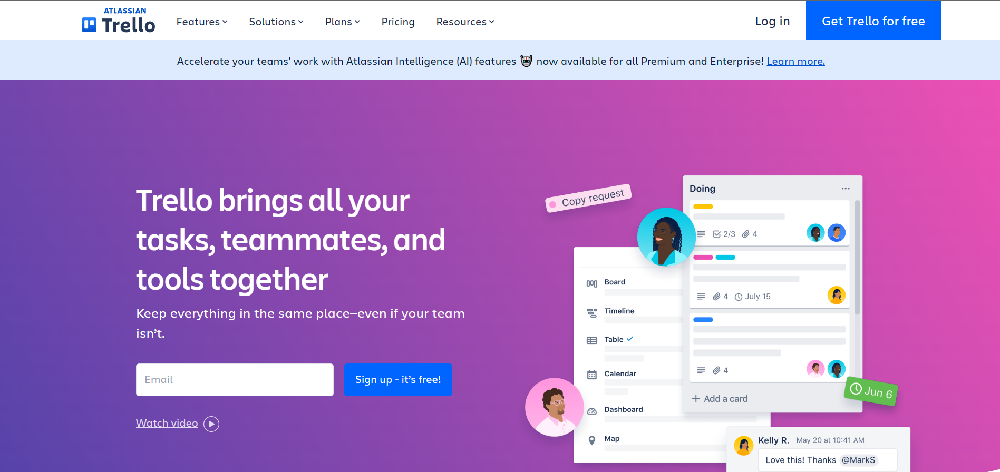
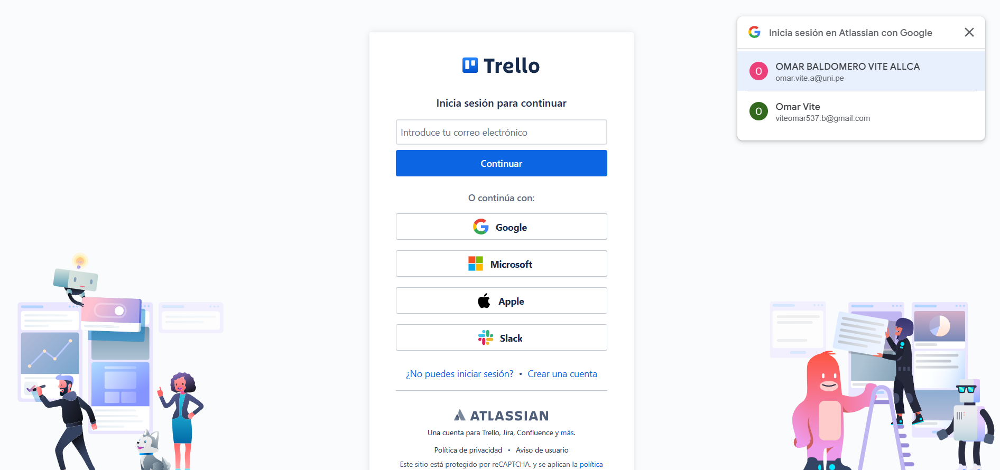
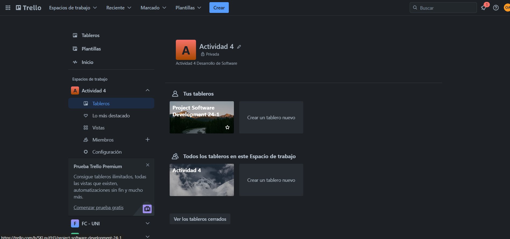
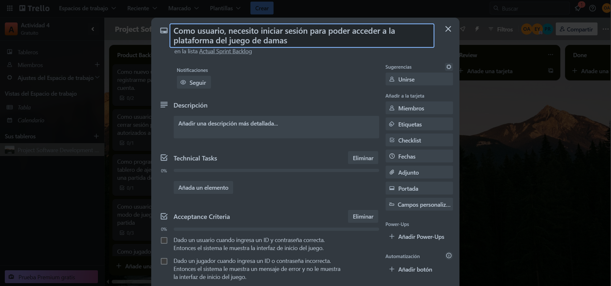

# Actividad Trello

En esta activididad se va a utilizar la plataforma Trello para poder trabajar con la metodología scrum

1. Ingresamos a la plataforma

2. Iniciamos Sesion

3. Accedemos a nuestro espacio de trabajo y tablero

4. Empezamos a escribir las historias de usuario, criterios de aceptacion y requerimientos tecnicos

5. Por ultimo agregamos los puntos de historia 

En conclusion Trello facilita la creación de tableros personalizados que reflejan los diferentes elementos de Scrum, como las historias de usuario, las tareas pendientes, en progreso y completadas, así como los sprint backlogs y las reuniones diarias. Además, la capacidad de arrastrar y soltar elementos permite una fácil actualización y reorganización, lo que fomenta la colaboración y la transparencia dentro del equipo.

