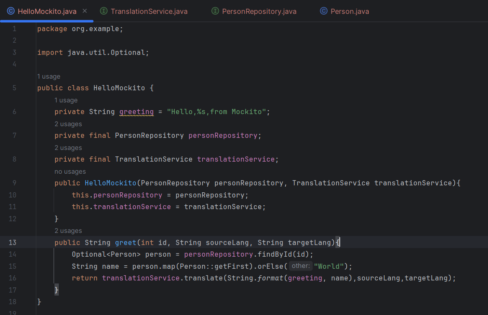
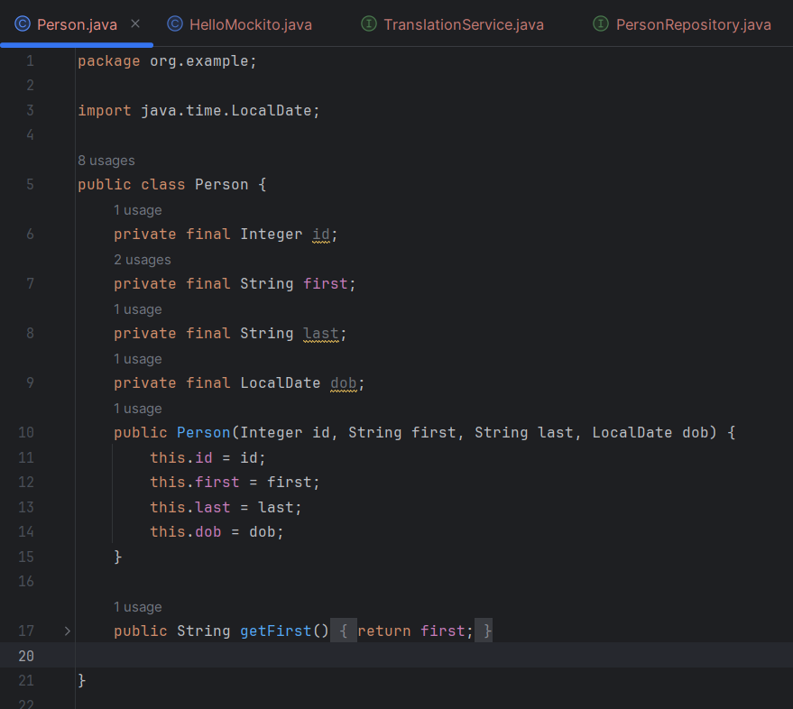
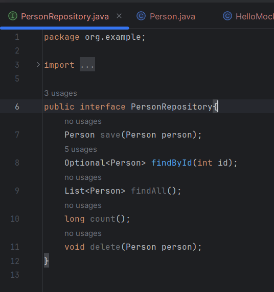

# Parte 1

En esta parte se va a configurar el proyecto gradle con Mockito

- Para esto agregamos las siguientes dependencias en nuestro archivo build.gradle

Luego seguimos con nuestra base de pruebas

- Clase HelloMockito

Es nuestra clase principal que tiene como metodo a `greet` el cual saluda a una persona desde Mockito

- Clase Person

Una clase persona que tiene como atributos id, nombre, apellido y fecha local

- Interface PersonRepository

Interfaz de un repositorio donde estan todas las personas (objetos de tipo Person)

- Interface TranslationService

Servicio de traducción, si bien esta incompleto se utilizaría para traducir texto en general

- Test HelloMockitoFull

## Ejercicio 1

## Ejercicio 2

## Ejercicio 3
# Parte 2
