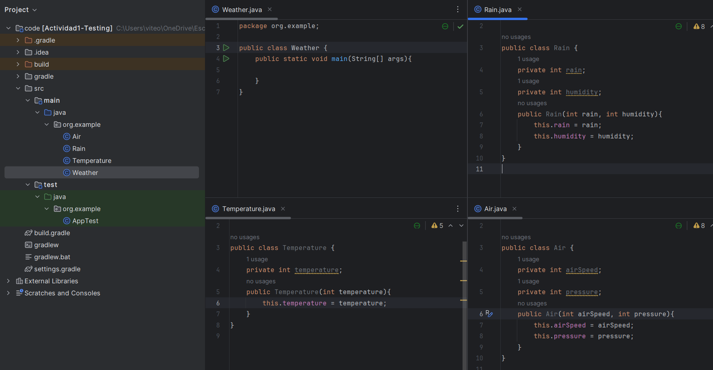
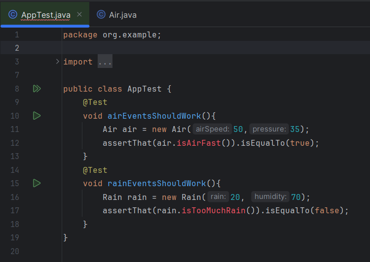
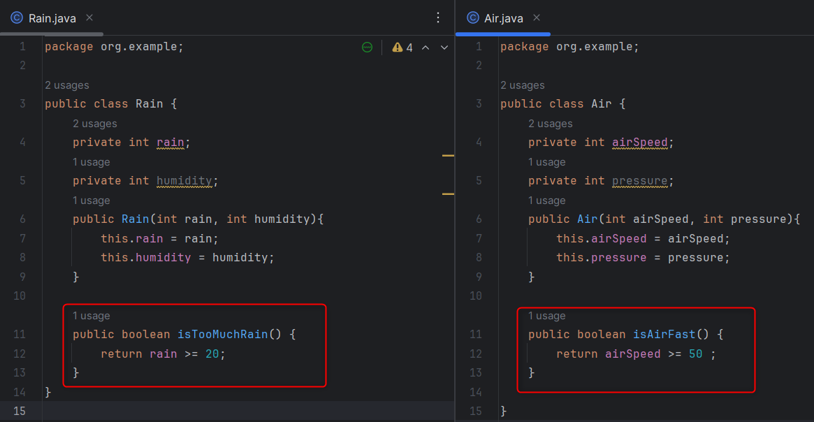
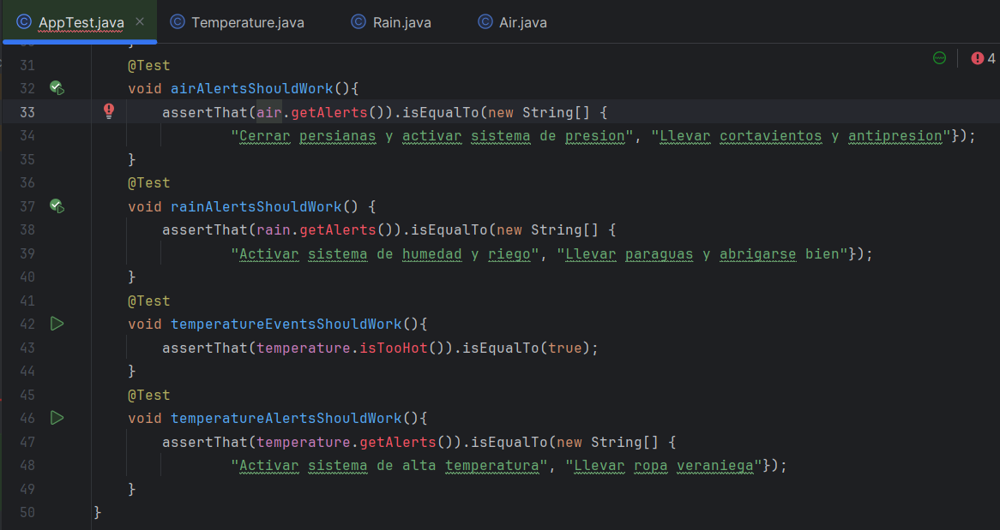
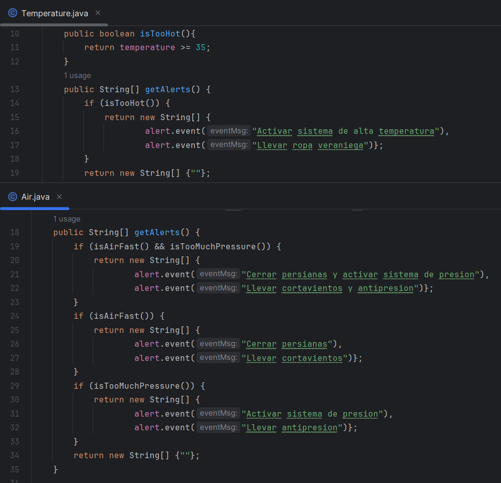
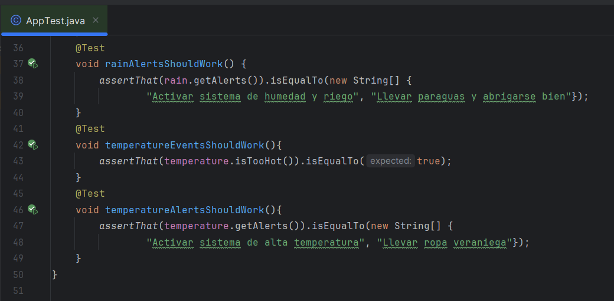
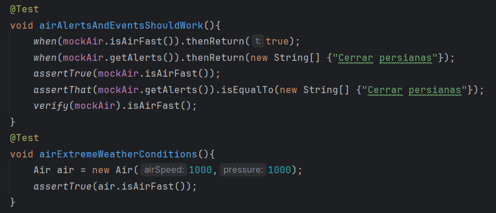
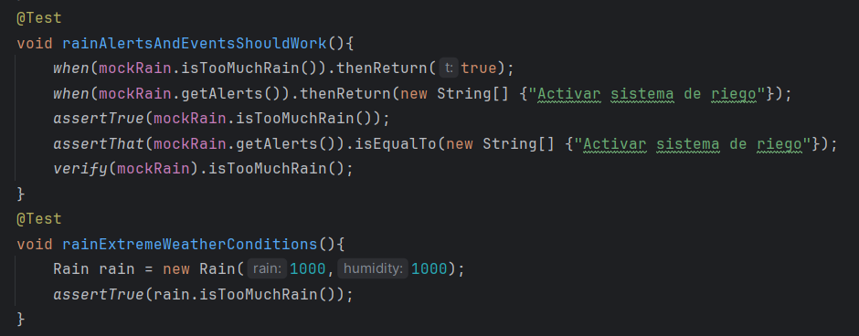
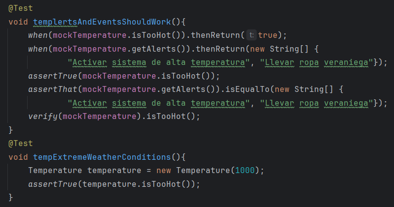

# Sprint 1

# Diseño e implementación inicial

Estructura de las clases del proyecto

`Clase Temperature`: Contiene la variable temperatura asi como futuros metodos para calcular eventos relacionados con esta misma

`Clase Rain`: Tiene como parametro la cantidad de lluvia y la humedad ademas maneja los metodos para calcular eventos relacionados con estas varibles

`Clase Air`: Controla los eventos relacionados con la velocidad del viento, la humedad

`Clase Weather`: Clase principal donde se llevara a cabo toda la logica

# Desarrollo con TDD

Para empezar a desarrollar la logica de nuestro proyecto usaremos TDD, creamos nuestro archivo de pruebas y los metodos para testear la funcionalidad

Al correr las pruebas fallan, entonces codeamos la logica necesaria para que pasen

Y ahora las pruebas pasan en verde, procedemos con la demas logica del proyecto.

Pruebas en rojo:

Logica para que las pruebas pasen:

Pruebas en verde:

# Validacion de pruebas con stubs y fakes

Creamos stubs y fakes para simular condiciones climaticas extremas

Y de igual manera para todas las clases

Rain

Temperature

# Refactorizacion y codigo limpio

# Metricas de calidad

