# Ejercicio 1

## Sprint 1: Estructura básica y preguntas

En este sprint configuramos nuestro entorno del proyecto Gradle y agregamos la dependencia JUnit 5

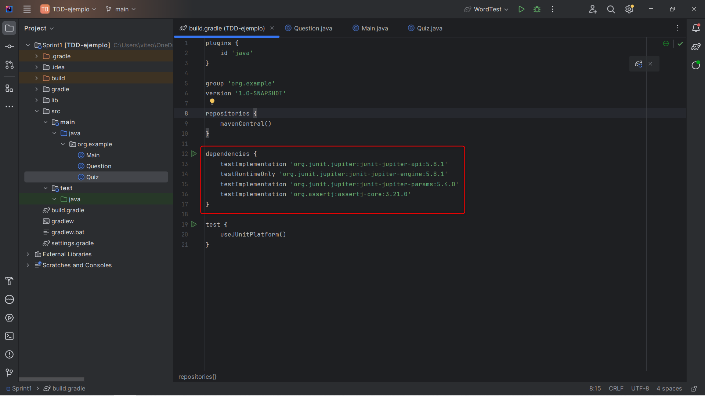

### Clase Question

Una vez tengamos el entorno empezamos a desarrollar la clase Question que se encargara de las preguntas  asi como sus respuestas y opciones disponibles

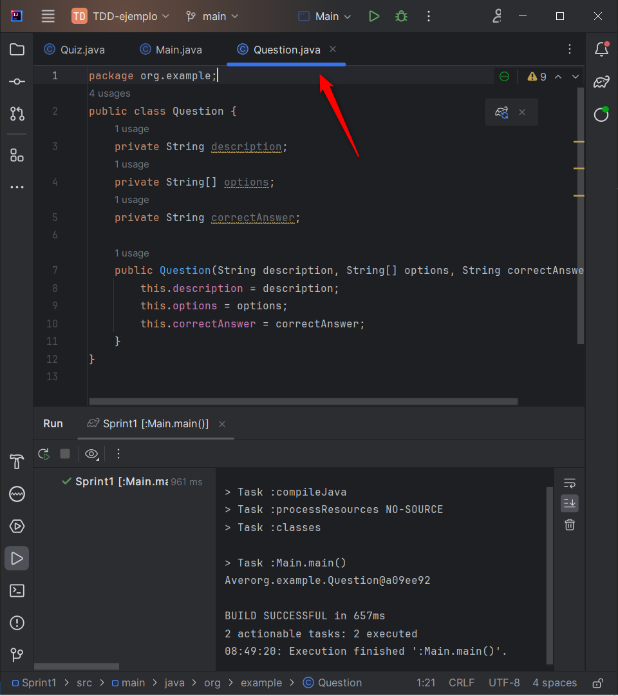

Agregamos los atributos description, option y correctAnswer asi como su constructor

### Clase Quiz

La clase Quiz se encarga del flujo del juego, en esta se almacenan las preguntas asi como los metodos para almacenarlas y mostrarlas

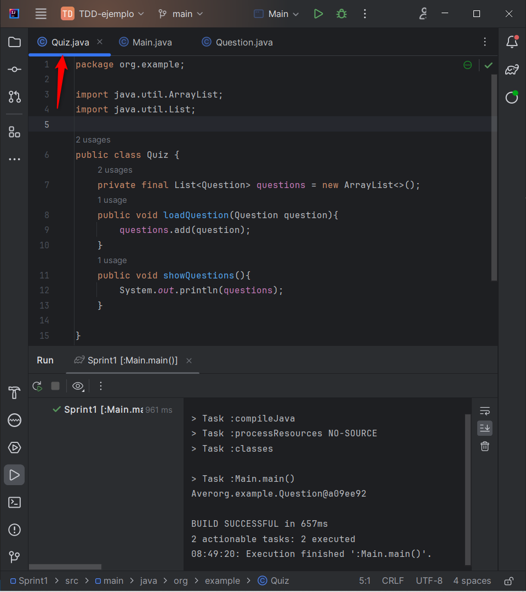

### Pruebas unitarias

Ahora codeamos unas pruebas utilizando AAA 

Prueba para verificar que las preguntas sean cargadas correctamente:

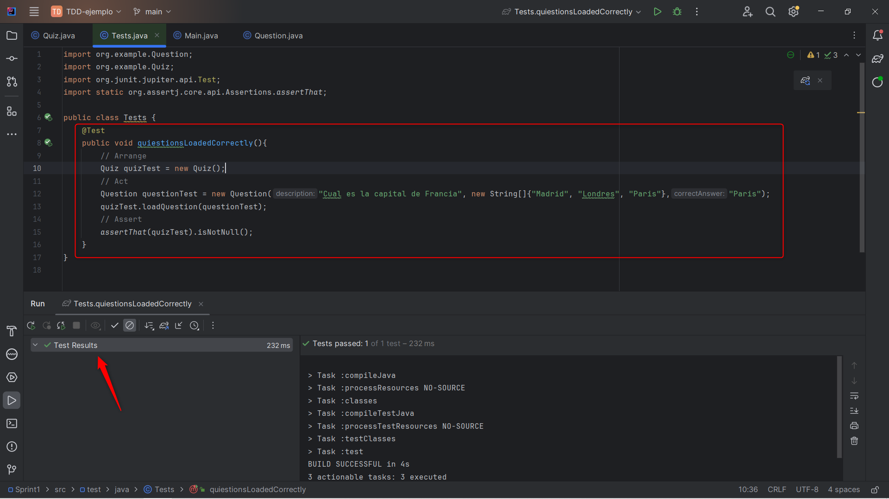

Pruebas para que las respuestas sean validadas correctamente:

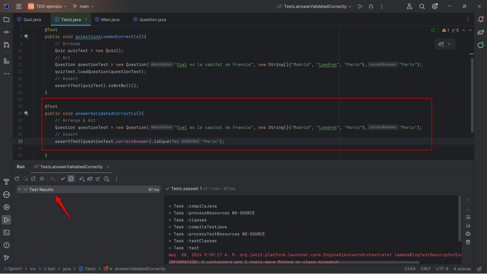

Como se observa en ambos casos las pruebas pasan

## Sprint 2: Lógica del juego y puntuación

Este sprint consiste en ampliar la logica para multiples rondas de juego asi como mostrar un resultado final al usuario.

Para lograr esto usare TDD, RGR y AAA, primero escribo la prueba y luego la logica. 

### Pruebas TDD RGR

- RED

Primero las pruebas fallan ya que no he implementado los metodos necesarios para cumplir los requerimientos

- GREEN

Ahora agregamos la logica necesario para pasar estas pruebas

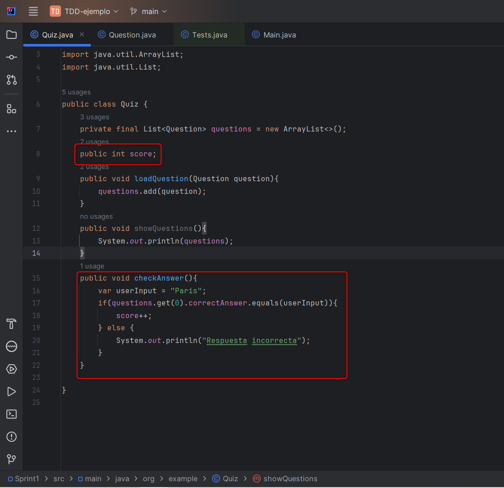

- REFACTOR (SONARLINT)

En este caso una pequeña refactorizacion que podemos hacer es hacer nuestra variable score static para asi tener un correcto control de atributos

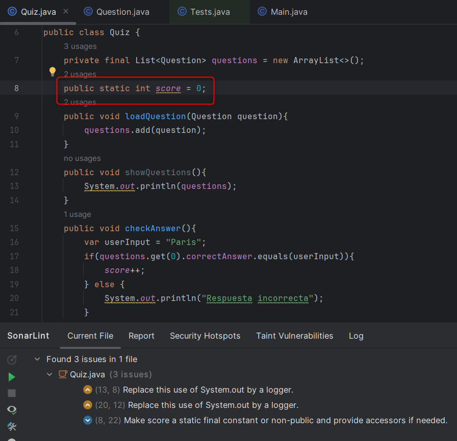

Ahora volvemos a repetir el proceso para implementar la funcionalidad de mostrar el resultado final al usuario

### Pruebas TDD RGR

- RED

Escribimos las pruebas para cuando se muestran los resultados obtenidos en el juego y como se esperaba las pruebas fallan

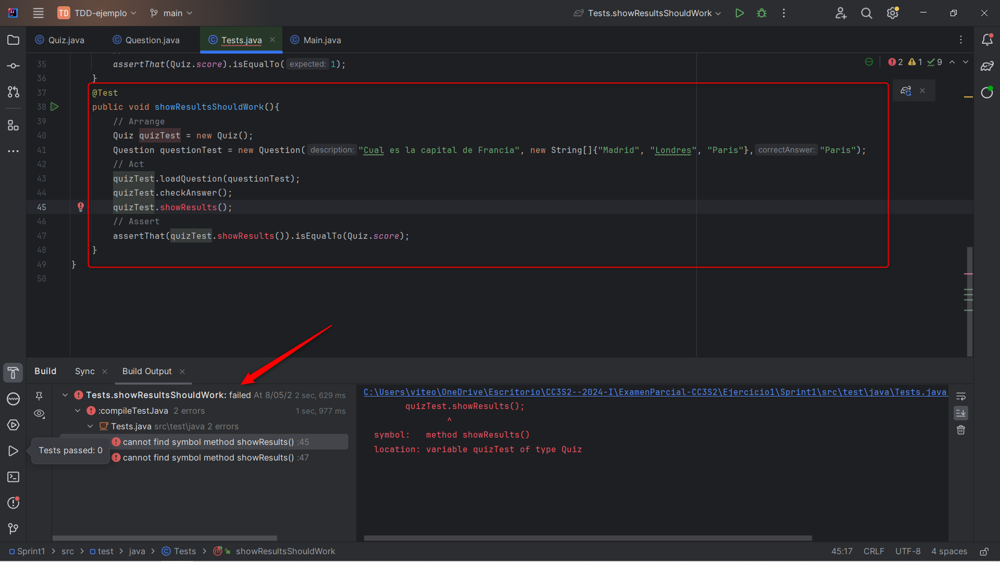

- GREEN

Agregamos la logica para hacer pasar las pruebas a verde

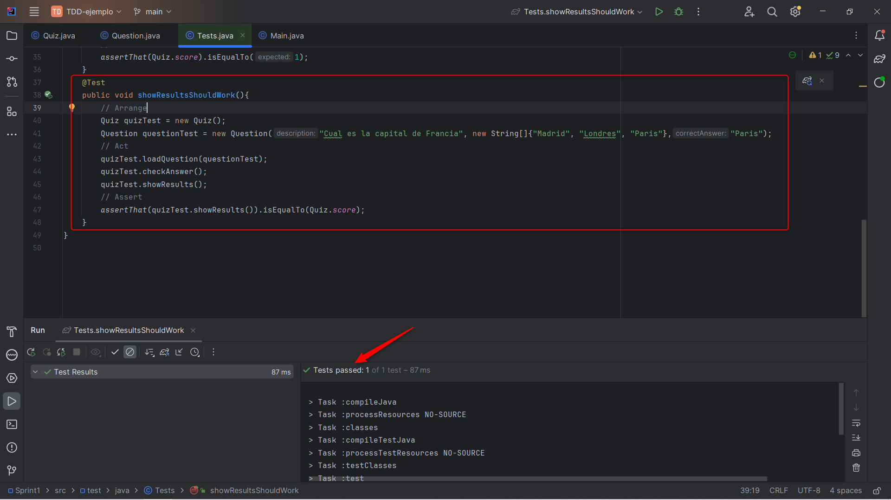

- REFACTOR

Y por ultimo pasamos a revisar el codigo con sonarlint y refactorizarlo, en este caso nos recomienda cambiar el tipo de definicion de ciertas variables asi como utilizar un logger en vez de un systm.out, ya que el logger proporciona informacion detallada sobre el output

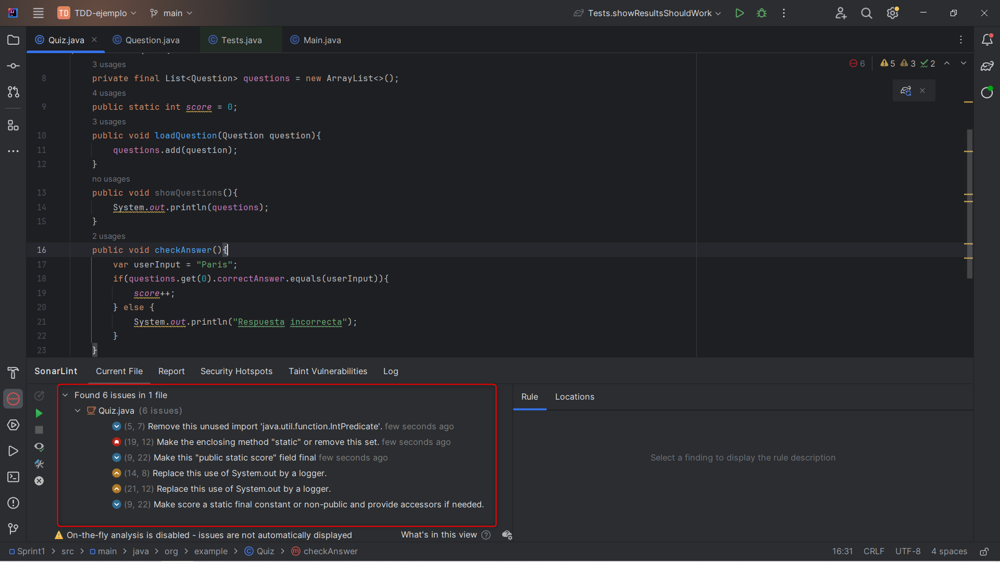

## Sprint 3: Mejoras en la interfaz y refinamiento

Por ultimo en el Sprint 3 mejoraremos la interfaz de nuestro programa para hacerla mas amigable con el usuario y agregar niveles de dificultad

Agregamos una interfaz con las distintas opciones a escoger

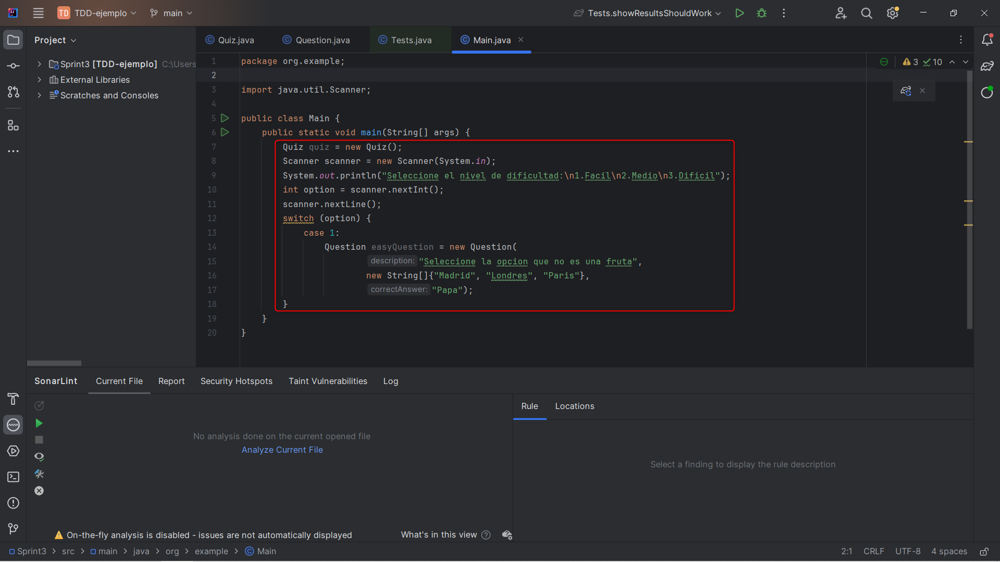