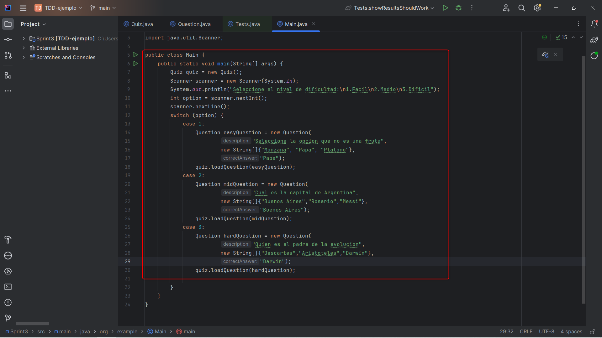

# Ejercicio 1

## Sprint 1: Estructura básica y preguntas

En este sprint configuramos nuestro entorno del proyecto Gradle y agregamos la dependencia JUnit 5

### Clase Question

Una vez tengamos el entorno empezamos a desarrollar la clase Question que se encargara de las preguntas  asi como sus respuestas y opciones disponibles

Agregamos los atributos description, option y correctAnswer asi como su constructor

### Clase Quiz

La clase Quiz se encarga del flujo del juego, en esta se almacenan las preguntas asi como los metodos para almacenarlas y mostrarlas

### Pruebas unitarias

Ahora codeamos unas pruebas utilizando AAA 

Prueba para verificar que las preguntas sean cargadas correctamente:

Pruebas para que las respuestas sean validadas correctamente:

Como se observa en ambos casos las pruebas pasan

## Sprint 2: Lógica del juego y puntuación

Este sprint consiste en ampliar la logica para multiples rondas de juego asi como mostrar un resultado final al usuario.

Para lograr esto usare TDD, RGR y AAA, primero escribo la prueba y luego la logica. 

### Pruebas TDD RGR

- RED

Primero las pruebas fallan ya que no he implementado los metodos necesarios para cumplir los requerimientos

- GREEN

Ahora agregamos la logica necesario para pasar estas pruebas

- REFACTOR (SONARLINT)

En este caso una pequeña refactorizacion que podemos hacer es hacer nuestra variable score static para asi tener un correcto control de atributos

Ahora volvemos a repetir el proceso para implementar la funcionalidad de mostrar el resultado final al usuario

### Pruebas TDD RGR

- RED

Escribimos las pruebas para cuando se muestran los resultados obtenidos en el juego y como se esperaba las pruebas fallan

- GREEN

Agregamos la logica para hacer pasar las pruebas a verde

- REFACTOR

Y por ultimo pasamos a revisar el codigo con sonarlint y refactorizarlo, en este caso nos recomienda cambiar el tipo de definicion de ciertas variables asi como utilizar un logger en vez de un systm.out, ya que el logger proporciona informacion detallada sobre el output

## Sprint 3: Mejoras en la interfaz y refinamiento

Por ultimo en el Sprint 3 mejoraremos la interfaz de nuestro programa para hacerla mas amigable con el usuario y agregar niveles de dificultad

Agregamos una interfaz con las distintas opciones a escoger

### Preguntas relacionadas al juego Trivia (4 puntos) 

1. ¿Qué caracteriza a una metodología ágil y cómo se aplicaría al desarrollo del juego de trivia?

La metodologia agil se caracteriza por adaptarse al cambio, en este caso del juego trivia el agile nos sirve para implementar futuras funcionalidades como juego online, historial de partidas, etc.

Describe las características principales como la iteración rápida, la adaptabilidad y la 
colaboración, y explica cómo estas pueden mejorar el desarrollo y la entrega del juego.

2. Explica cómo el principio de entrega continua podría implementarse en el proyecto del juego de trivia usando Gradle. Discute el uso de Gradle para automatizar compilaciones, pruebas y despliegues, facilitando una integración y entrega continuas.

CI/CD se puede implementar agregando pruebas automatizadas dentro de la logica de juego, ya sea para probrar codigo estatico asi como para probrar conexiones a apis en caso de un futuro deploy.

3. Describa el ciclo TDD y cómo se aplicaría a una nueva característica en el juego, como la implementación del sistema de puntuación. Explica el ciclo de "Red-Green-Refactor" y cómo utilizaría TDD para desarrollar y validar la lógica de puntuación del juego.

TDD (Test driven development) consiste en codear a partir de pruebas, es decir primero se escriben las pruebas luego el codigo fuente para asi pasar las pruebas  y finalmente refactorizar (RGR). En este caso se utilizo TDD y RGR para desarrollar la funcionalidad de mostrar un resultado final al usuario

4. ¿Cuáles son los beneficios de utilizar TDD en el desarrollo de software y cómo ayuda a 
prevenir regresiones en el juego de trivia?

TDD tiene muchos beneficios como desarrollar código limpio apartir de pruebas unitarias, este proceso ayuda a 

5. Proporciona un ejemplo de cómo podrías refactorizar un bloque de código del juego de 
trivia para mejorar su mantenibilidad.

6. Explica la importancia de la refactorización en los sprints de desarrollo ágil y cómo se integra en el proceso de TDD. Discute cómo la refactorización es una parte integral del ciclo de TDD y cómo contribuye a la mejora continua del código en un entorno ágil.

La refactorizacion es un punto esencial dentro del desarrollo de software en general, nos permite tener un codigo mas escalable y mantenible apto para los cambios que es el principal proposito del metodo agile

7. Describe cómo JUnit 5 puede utilizarse para implementar pruebas parametrizadas en el 
juego de trivia. Proporciona un ejemplo concreto. Explica la funcionalidad de las pruebas 
parametrizadas en JUnit 5 y cómo se podría usar para probar diferentes casos de entrada 
para validar la lógica del juego.

8. ¿Qué características nuevas introduce JUnit 5 que son particularmente útiles para proyectos complejos como el juego de trivia?