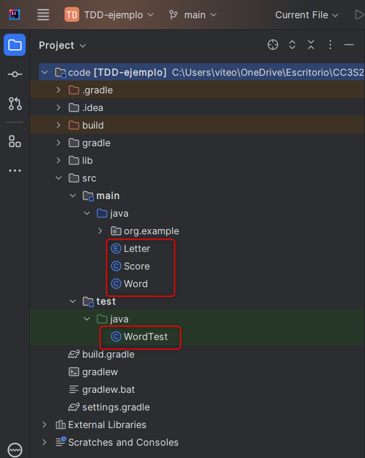
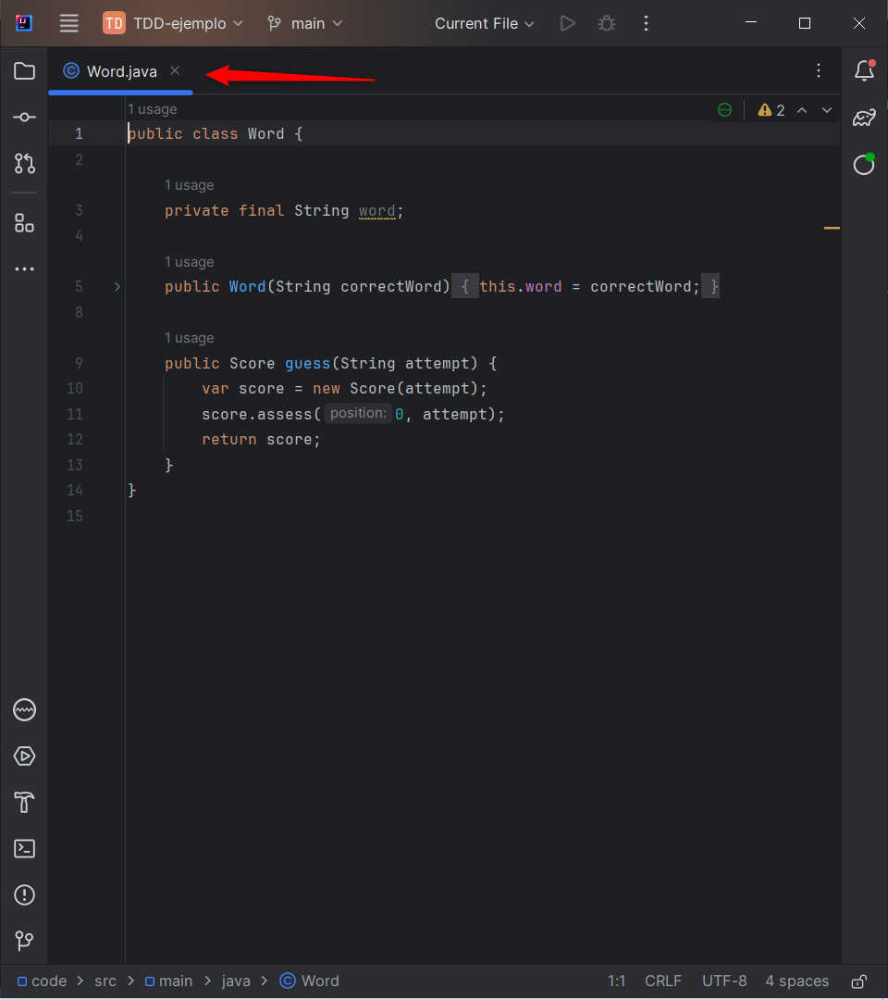
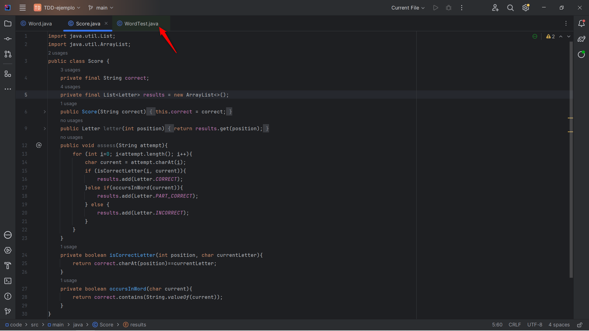
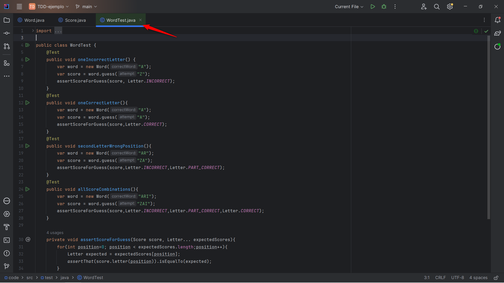
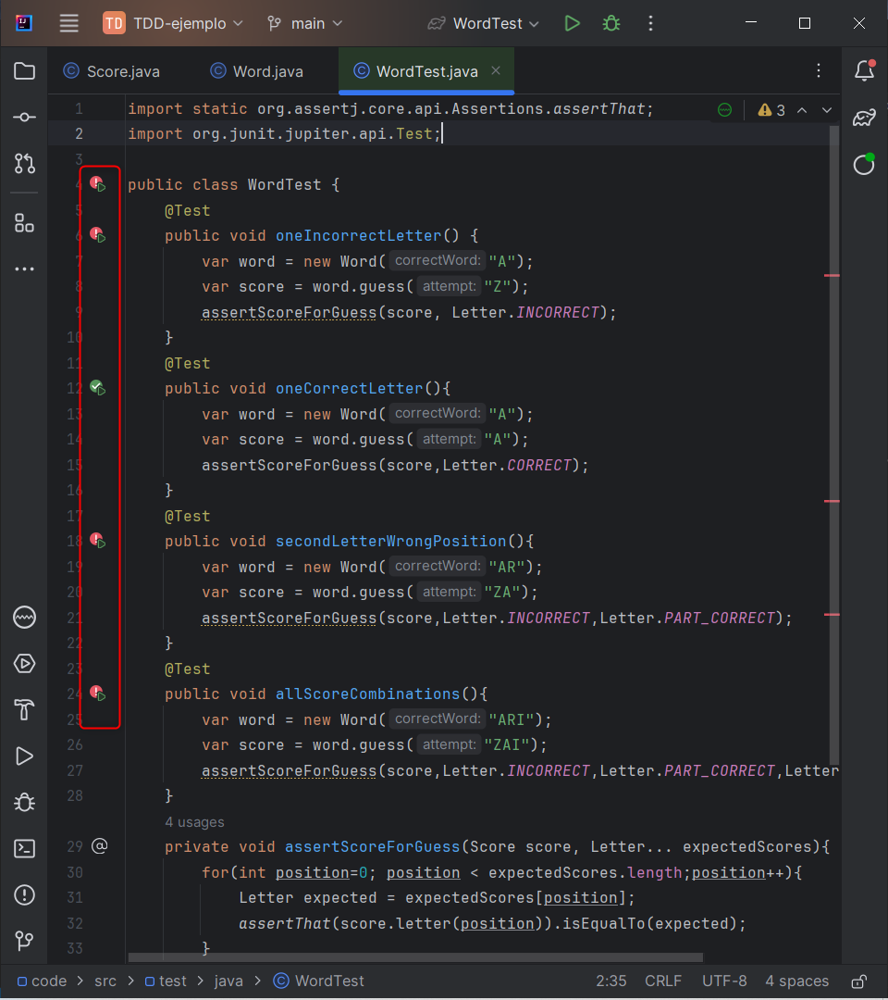

# Ejercicio 2

## Sprint 1: Configuración inicial y funcionalidad básica

Primero necesitamos la configuracion del proyecto, para esto utilizaremos un entorno previamente creado en la actividad de TDD

### Clase Word

Una vez tengamos la configuracion del proyecto, implementamos la clase Word

### Clase Score

Implementamos la clase score que evaluaras las respuestas y almacenará los resultados

### Clase WordTest

Por ultimo añadimos los tests para las clases Word y Score usando la herramienta JUnit

## Sprint 2: Ampliacion de la logica del juego

En esta seccion vamos a analizar y ampliar la logica del código, para empezar corremos las pruebas

Se observa que solo una prueba pasa los tests. La consola nos dice que se esperaba CORRECT en vez de INCORRECT, vamos a analizar en qué está fallando

## Sprint 3: Interfaz de usuario de consola y finalizacion