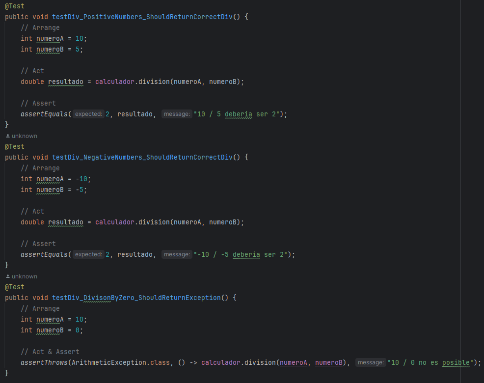
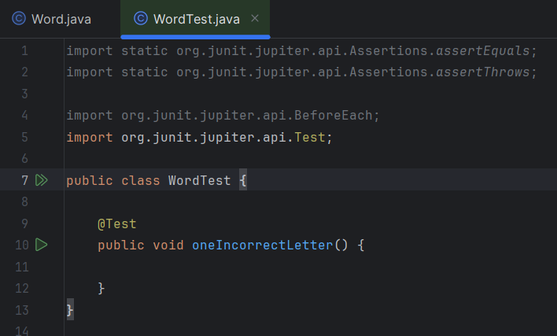

# Ejercicio 1

# Actividad AAA

## Paso 1

La clase Calculator tiene metodos simples para sumar, multiplicar y dividir (tomando en cuenta su excepcion de division por cero)

## Paso 2: Especificación de la tarea

Escribimos los tests para cada uno de los métodos definidos previamente, para esto utilizaremos el patrón AAA (Arrange - Act - Assert) el cual nos permite tener un orden en la escritura de los tests.

Primero usamos la anotacion `@BeforeEach` para que cada que ejecutemos una prueba se instancie un objeto de la clase Calculator  y asi nos ahorramos el estar instanciando en cada test 

- Tests para el método `sumar`

**Arrange**: Declaración de las variables numeroA y numeroB

**Act**: Llamamos al método sumar del objeto calculador y guardamos la respuesta en nuestra variable resultado

**Assert**: Verificamos que la respuesta obtenida sea la esperada

- Tests para el método `restar`

**Arrange**: Declaración de las variables numeroA y numeroB

**Act**: Llamamos al método restar del objeto calculador y guardamos la respuesta en nuestra variable resultado

**Assert**: Verificamos que la respuesta obtenida sea la esperada

- Tests para el método `multiplicacion`

En la multiplicacion tomamos en cuenta los casos negativos para evitar errores de signo

**Arrange**: Declaración de las variables numeroA y numeroB

**Act**: Llamamos al método multiplicacion del objeto calculador y guardamos la respuesta en nuestra variable resultado

**Assert**: Verificamos que la respuesta obtenida sea la esperada

- Tests para el método `division`

En la división se toma en cuenta tanto los casos negativos como la division entre cero. Para manejar este caso se usó una excepcion en la clase `Calculator` por ende usamos `assertThrows` en vez de `assertEquals`

**Arrange**: Declaración de las variables numeroA y numeroB

**Act**: Llamamos al método division del objeto calculador y guardamos la respuesta en nuestra variable resultado

**Assert**: Verificamos que la respuesta obtenida sea la esperada

## Paso 3: Ejecución de los tests
Por último ejecutamos todas las pruebas ya sea con el comando `gradle test` o usando la misma interfaz que nos ofrece intellij

Se observa que los 7 tests que codeamos pasaron correctamente las pruebas

# Actividad TDD

En esta vamos a seguir el Test Driven Development para codear un juego Wordz. Como estamos en TDD se empieza por las pruebas respectivas y a medida que se va avanzando se va programando la lógica del juego

1. Escribimos un método para comenzar la prueba de una letra incorrecta dentro la clase WordTest

2. Instanciamos  