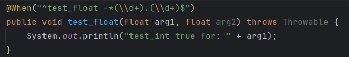

# Ejercicio 3

## Expresiones regulares

1. **test_posint**

Para esta prueba debemos escribir una expresion regular que deba coincidir con el string "test_posint" seguido de una secuencia de digitos de longitud arbitraria

- "^" define el inicio de la expresión
- test_posint establece un string de caracteres
- (\ \d+) toma un bloque de digitos conformados del 0-9 y lo pasa como argumento
- $ define el final de la expresion

2. **test_int**

Para esta prueba debemos escribir una expresion regular que deba coincidir exactamente con el string "test_int" seguido de un signo negativo opcional y una secuencia de digitos de longitud arbitraria

- "^" define el inicio de la expresión
- test_int establece un string de caracteres
- -? hace opcional al signo -
- (\ \d+) toma un bloque de digitos conformados del 0-9 y lo pasa como argumento
- $ define el final de la expresion

3. **test_float**

Para esta prueba debemos escribir una expresion regular que deba coincidir exactamente con el string "test_float" seguido de un signo negativo opcional, una secuencia de digitos de longitud arbitraria, un punto y otra secuencia de digitos

4. **test_ip_address**

Para esta prueba debemos escribir una expresion regular que deba coincidir exactamente con el string "test_ip_address" seguido de 4 secuencia de digitos separados por un punto 

5. **test_splitter**

6. **test_splitter2**

