# Practica Calificada 5
## Ejercicio 1: Configuracion y uso de Docker

### Teoria

- Los imagenes son plantillas inmutables que contienen el codigo de la aplicacion, dependencias, bibliotecas, etc. Estas son inmutables es decir una vez creadas no pueden ser modificadas mas si pueden ser reutilizadas. Las imagenes se utilizan para crear contenedores, los cuales son instancias ejecutables de imagenes, es decir proporcionan un entorno aislado para las imagenes

- Docker a comparacion de las maquinas virtuales es mucho mas liviano y mas rapido ademas que una maquina virtual copia todo un kernel, los contenedores de docker no, solo lo necesario para correr una aplicacion. Sin embargo las maquinas virtuales son mas utiles para trabajar con varios sistemas operativos que un contenedor de docker.

### Practico

Primero vamos a crear un docker file con nuestra version de java y copiamos nuestro proyecto en la imagen para luego ejecutarlo en el contenedor. Ejecutamos nuestro docker file con `docker build -t tower-defense-image .`

Otra manera de hacerlo es usando la interfaz del plugin de Docker dentro de Intellij

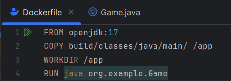

Le damos al boton verde y escogemos la opcion de editar donde agregaremos un tag a nuestra imagen asi como tambien podemos definir el nombre del contenedor

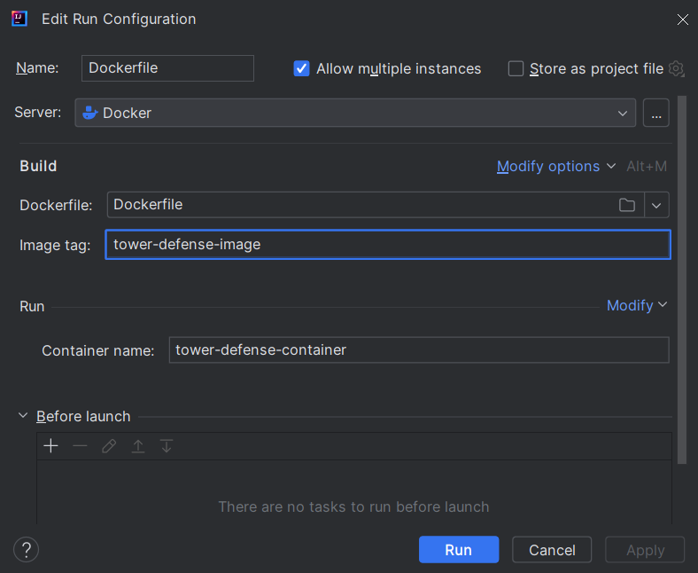

Aplicamos, corremos y verificamos que nuestro contenedor se haya creado correctamente

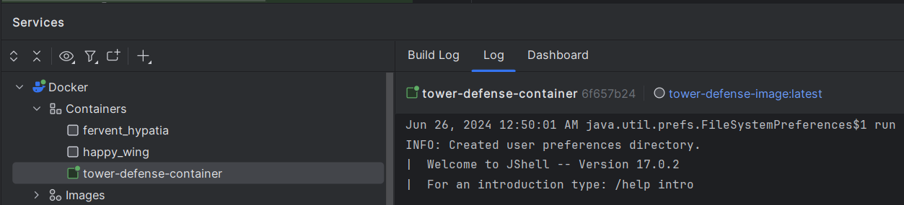

Docker exec nos permite ejecutar comandos dentro de un contenedor en ejecucion, en este ejemplo voy a mostrar el directorio de archivos de nuestro contenedor

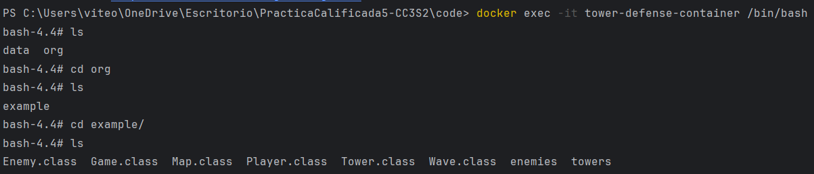

Accedemos al contenedor en ejecucion y vamos navegando entre los directorios disponibles

## Ejercicio 2: Redes y Volúmenes en Docker

### Teoria

- Las redes nos ayudan a gestionar la comunicacion entre contenedores, con el host y con otros dispositivos entre si. Hay varios tipos de redes como el bridge (comunicacion puente), host (los usuarios tienen acceso al host), none (se aisla un contenedor de los demas), overlay.

- Los volumenes por otro lado sirven para persistir los datos generados y ser utilizados por los contenedores, estos volumenes pueden ser compartidos entre multiples contenedores.

### Practico

- Network

Una vez tengamos nuestro contenedor con su imagen creamos nuestra red en la seccion `Networks`, le damos al boton `Create Network` y le ponemos un nombre. Tambien podemos ejecutar `docker network create game-network`

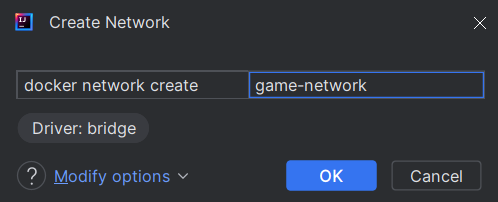

Verificamos que se haya creado y en la seccion `Containers` le damos al boton `Add`

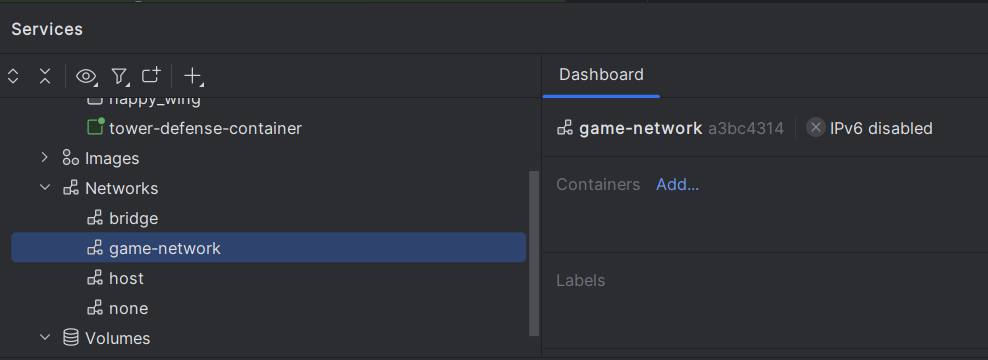

Escogemos nuestro contenedor `tower-defense-container` y lo conectamos

> Es necesario que el contenedor este corriendo para que podamos conectarlo

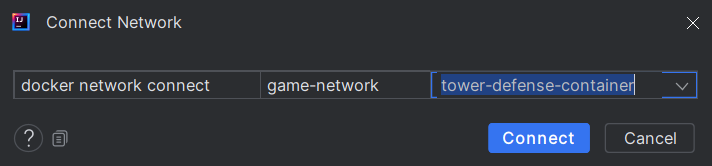

Y en el dashboard se visualiza nuestra red con el container respectivo

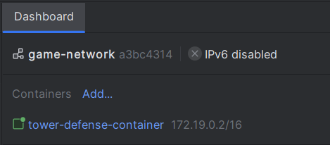

- Volume

Ahora para crear un volumen ejecutamos `docker volume create game-data` o tambien le podemos dar al boton `Create Volume` en el dashboard y le asiganmos un nombre

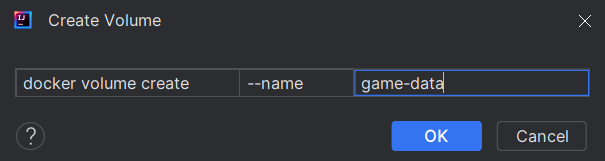

Ahora para vincularlo vamos al dashboard de nuestro container y le damos a agregar volumen luego modificamos las opciones y escogemos host path ya que tenemos nuestro volumen creado, por ultimo definimos una ruta para el container

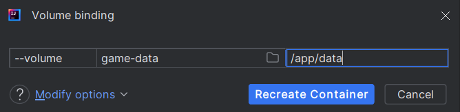

Verificamos que este montado

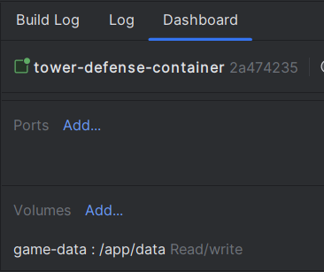

- Docker Compose

Docker compose es una herramienta que permite definir y gestionar aplicaciones multi-contenedor en Docker. Utiliza un archivo de configuración YAML para especificar los servicios, redes y volúmenes necesarios para una aplicación

Creamos nuestro `docker-compose.yaml`

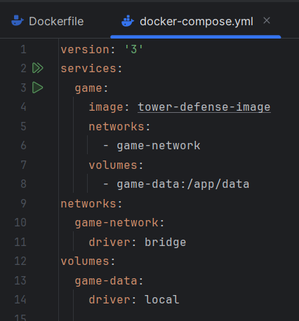

Y lo ejecutamos con `docker-compose up`

Verificamos que se hayan iniciado los servicios tanto en intellij como en Docker desktop

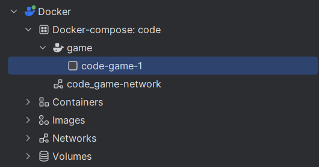

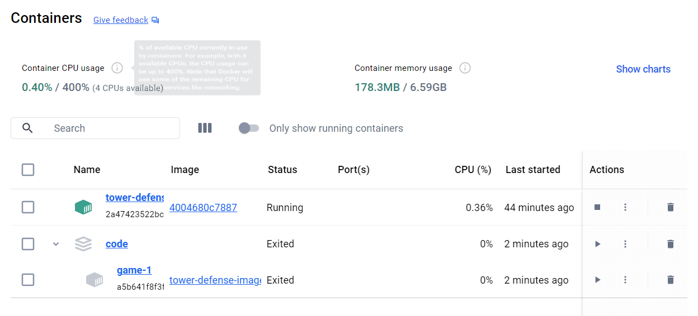

## Ejercicio 3: Orquestacion con Kubernetes

### Teoria

- Kubernetes es una plataforma de orquestación de contenedores que automatiza la implementación y gestión de aplicaciones en contenedores. Sus componentes principales incluyen el API Server, que expone la API y maneja las solicitudes; etcd, que almacena el estado del clúster; el Scheduler, que asigna pods a nodos; y Kubelet, que ejecuta y gestiona contenedores en cada nodo

### Practico

Para poder desplegar nuestros archivos `game-development.yaml` y `game-service.yaml` debemos tener un cluster, para esto hay varias opciones en este caso usare docker desktop.

En docker desktop basta con habilitar kubernetes en la seccion de configuracion

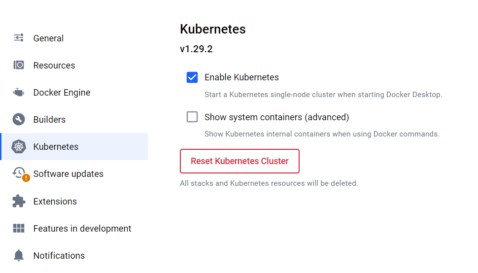

Una vez hecho ya podemos correr nuestros archivos con 

`kubectl apply -f game-development.yaml` y `kubectl apply -f game-service.yaml`

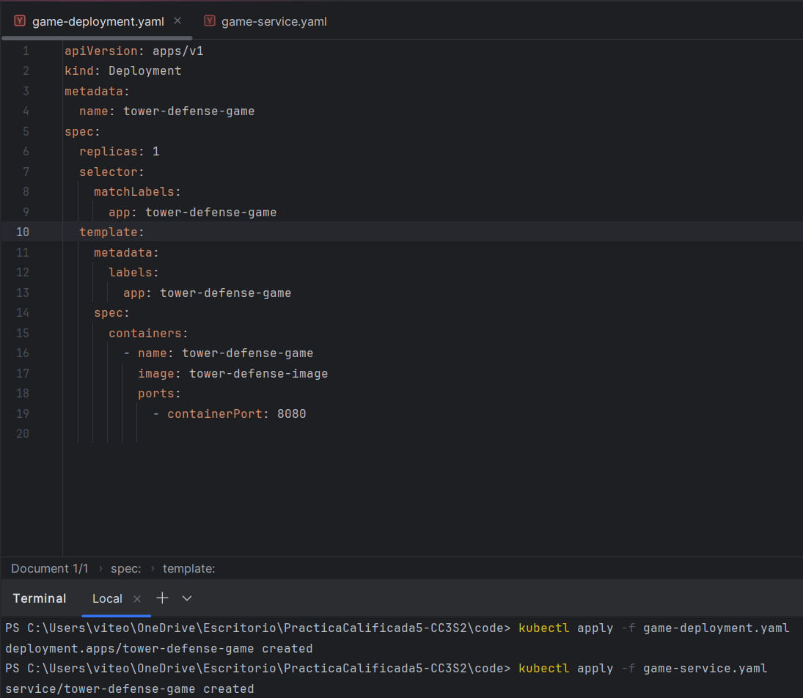

## Ejercicio 4: Pruebas unitarias y de integracion con Mockito

### Teoria

`Mocks`: Simulan un comportamiento complejo de un modulo
`Stubs`: Devuelven un valor especifico
`Fakes`: Copia de un modulo (fake) para manejarlo como querramos

Estos patrones deben ser utilizados para manejar pruebas que tengan dependencias externas como librerias, apis, bibliotecas que pueden fallar. Entonces al fallar la dependencia por ende nuestra prueba falla pero eso no significa que nuestra prueba haya sido escrita erroneamente, por esto utilizamos estos patrones para simular estas dependencias y evitar malentendidos al momento de correr las pruebas unitarias

### Practico
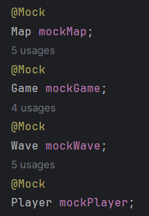

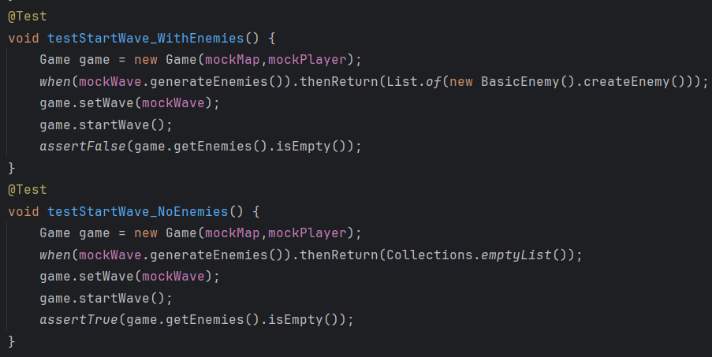

Estas pruebas verifican que las oleadas hayan sido iniciadas cuando creamos un game con un mapa y jugador como argumentos

## Ejercicio 5: Pruebas de mutación

### Teoria

Las pruebas de mutacion nos sirven para resaltar y evitar comportamientos inesperados, si al momento de realizar una mutacion en un test y correrla falla quiere decir que la prueba esta bien escrita (mutante KILLED) , caso contrario la prueba esta mal escrita (mutante SURVIVED).

### Practico

- Configuramos Pitest en nuestro proyecto

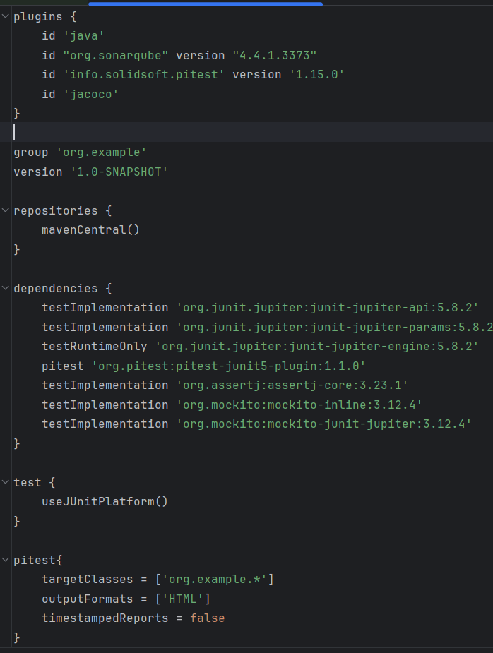

En nuestro archivo build.gradle agregamos el plugin pitest, la dependencia pitest y la configuracion principal de pitest

Corremos pitest con `./gradlew pitest` y abrimos nuestro reporte

Nos indica que hay codigo sin coverage asi como tambien mutaciones que han sobrevivido

## Ejercicio 6: Diseño por Contrato

### Teoria

El diseño por contrato trata a los componentes de un software como participantes de un contrato, es decir van a tener obligaciones que cumplir. En el contexto del desarrollo estas obligaciones serian las pre y post condiciones donde las precondiciones definen reglas a cumplir antes de ser ejecutados los metodos y las postcondiciones verifican que una vez ejecutado los valores esten siguiendo las reglas esperadas

### Practico

Agregamos las precondiciones (vida previa del enemigo antes de ser atacado) y las post condiciones (recorre todos los enemigos para verificar que hayan sido atacados, es decir que su vida inicial sea distinta a la actual)

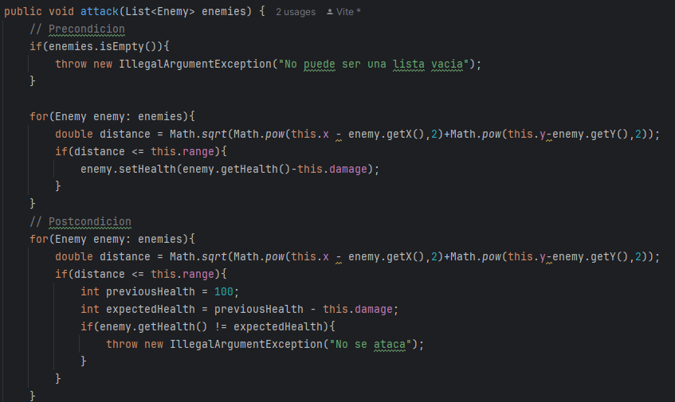

Escribimos y corremos las pruebas unitarias donde se crea una lista de enemigos, establecemos la posicion del enemigo asi como tambien la posicion de la torre, luego llamamos al metodo attack y verificamos que se haya atacado

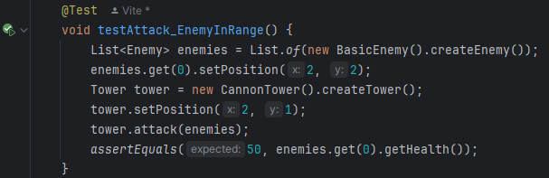

